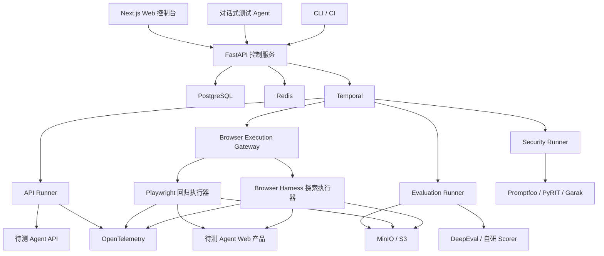

# Agent 自动化测试与安全评估平台产品需求文档

| 文档信息 | 内容 |
|---|---|
| 文档版本 | V1.0 |
| 文档日期 | 2026-06-25 |
| 产品阶段 | 需求定义 / MVP 规划 |
| 产品定位 | 面向开发与测试团队的通用 Agent 自动化测试、评估与发布门禁平台 |
| 首个落地场景 | AI 创作画布 Agent |

后续 AI 和人工开发必须遵守根目录 `AGENTS.md`，并持续更新 `docs/开发进度与变更记录.md`。

---

## 1. 文档摘要

本产品用于帮助开发、测试和算法团队持续验证 Agent 的任务完成能力、工具调用过程、业务状态变化、输出内容质量、安全边界、成本和性能。

平台同时支持 API 白盒测试与浏览器端到端测试，通过统一测试协议、插件化适配体系和多种评分器，覆盖画布 Agent、客服 Agent、浏览器 Agent、数据分析 Agent、RAG Agent、工作流 Agent、Coding Agent 和语音 Agent 等不同产品。

首个版本重点服务 AI 创作画布 Agent：测试 Agent 能否根据用户指令正确理解任务、调用图片或视频模型、创建和连接画布节点，并生成符合要求的内容。

产品核心形态为：

> 对话式测试 Agent + 专业测试控制台 + 自动化执行引擎 + 多维评测引擎 + 安全红队引擎

---

## 2. 背景与问题

传统软件测试主要验证确定性的输入输出，而 Agent 产品具有以下特点：

- 同一输入可能产生不同执行路径和输出。
- Agent 会规划任务、选择工具并修改外部系统状态。
- 最终回答正确，不代表执行过程安全或合理。
- 模型、提示词、工具和知识库的任一变更都可能导致能力退化。
- 图片、视频、语音等非结构化产物无法仅用精确匹配判断。
- Prompt Injection、越权工具调用和敏感信息泄露会产生真实业务风险。
- 浏览器界面测试容易受 UI 变化影响，纯 API 测试又无法覆盖真实用户链路。

当前团队缺少统一平台管理测试用例、批量执行任务、分析 Agent Trace、对比版本、评估多模态产物和验证安全边界。

---

## 3. 产品目标

### 3.1 核心目标

1. 为开发人员提供 Agent 单用例调试、Trace 分析和版本对比能力。
2. 为测试人员提供测试集、批量回归、断言、报告和发布门禁能力。
3. 同时验证 Agent 执行轨迹、产品业务状态和最终内容。
4. 支持 API 与浏览器两种执行模式。
5. 支持确定性规则、模型评分、参考结果对比和人工复核。
6. 支持安全攻击、工具权限、业务边界和资源消耗测试。
7. 通过插件体系逐步扩展到不同类型的 Agent 产品。

### 3.2 MVP 成功指标

- 新用户能够在 30 分钟内完成 Agent 接入并运行第一条用例。
- 单次支持 50–500 条回归用例。
- API 测试任务成功调度率不低于 99%。
- 关键浏览器用例能够保存截图、录像、网络记录和 Trace。
- 测试结果能够定位到具体 Agent 步骤、工具调用或业务状态差异。
- 支持两个 Agent 版本逐用例对比。
- 支持低质量版本在 CI/CD 中被自动拦截。
- 自动评分低置信度结果可以进入人工审核队列。

### 3.3 非目标

MVP 阶段暂不建设：

- 面向外部客户的商业 SaaS 计费系统。
- 大规模跨地域执行集群。
- 完整模型训练和微调平台。
- 通用 Prompt 管理平台。
- 生产流量的全量实时可观测平台。
- 自动修改线上 Agent 并直接发布。

---

## 4. 目标用户

### 4.1 Agent 开发工程师

主要诉求：

- 快速运行单条任务。
- 查看 Agent 推理步骤与工具调用。
- 比较 Prompt、模型和工具版本。
- 重现并修复失败案例。

### 4.2 测试工程师

主要诉求：

- 创建和维护测试集。
- 配置业务断言和评分标准。
- 批量运行回归测试。
- 管理人工审核与缺陷证据。
- 建立发布门禁。

### 4.3 算法与评测工程师

主要诉求：

- 开发和校准 Scorer。
- 管理参考答案和多模态评测规则。
- 分析随机性、方差和评审一致性。
- 评估不同模型和 Prompt 的效果。

### 4.4 研发负责人

主要诉求：

- 查看成功率、成本、延迟和安全趋势。
- 判断新版本是否可以发布。
- 了解能力退化和主要失败类型。

---

## 5. 产品设计原则

### 5.1 通用内核，领域插件

平台核心不写死画布节点、SQL、工单或代码补丁等业务字段。不同产品通过插件实现接入、环境初始化、产物提取和评分。

### 5.2 API 为主，浏览器为辅

- API 模式承担约 80% 的日常回归，追求速度、稳定性和可诊断性。
- 浏览器模式承担约 20% 的关键链路测试，验证真实用户体验和前后端集成。

### 5.3 结果与过程同时评估

测试不能只判断最终文本，还必须评估：

- Agent 是否选择了正确工具。
- 参数和调用顺序是否正确。
- 是否产生不必要或危险的动作。
- 最终业务状态是否符合预期。
- 生成内容是否满足质量要求。

### 5.4 自动化为主，人工兜底

规则和模型自动评分负责规模化回归；低置信度、评分冲突和高风险结果进入人工审核。

### 5.5 测试资产必须结构化

对话式测试 Agent 生成的测试计划、用例和评分规则必须保存为可编辑、可复用、可审计的结构化资产，不能仅存在于聊天记录中。

---

## 6. 产品整体交互

### 6.1 双入口设计

#### 对话式测试 Agent

适合快速创建任务、查询进度和分析结果。

示例：

> 测试画布 Agent v2.3，在商品视频模板上运行 100 条回归用例，重点检查节点连接、商品一致性和视频生成成功率，并与 v2.2 对比。

测试 Agent 应完成：

1. 识别测试目标和测试对象。
2. 选择或建议测试集、环境模板、执行模式和 Scorer。
3. 生成结构化测试计划草稿。
4. 显示预计用例数、执行时间和模型成本。
5. 请求用户确认高成本或高风险操作。
6. 启动任务并展示实时进度。
7. 汇总失败类型并解释可能原因。
8. 将失败案例转换为回归用例。

#### 专业测试控制台

适合精确配置、批量管理和深度分析，主要页面包括：

- 项目首页
- Agent 与版本
- 测试用例与数据集
- 测试计划
- 运行中心
- 用例结果工作台
- 实验对比
- 安全测试
- 人工审核
- 评分器管理
- 环境与凭证
- 发布门禁

### 6.2 首页布局建议

```text
┌────────────┬──────────────────────────┬──────────────────┐
│ 项目导航    │ 测试 Agent 对话区         │ 当前测试计划       │
│            │                          │                  │
│ Agent      │ 用户测试指令              │ Agent 版本        │
│ 测试集      │ 测试计划与过程消息         │ 测试集与用例数     │
│ 运行记录    │ 工具调用与确认卡片         │ API/E2E 模式      │
│ 安全测试    │                          │ 预计时间与成本     │
│ 人工审核    │ 输入测试任务……            │ 确认并运行         │
└────────────┴──────────────────────────┴──────────────────┘
```

### 6.3 结果工作台

```text
┌────────────────┬────────────────────────────────────────┐
│ 用例结果列表     │ 当前用例详情                            │
│                │                                        │
│ 通过 / 失败     │ 摘要 / Agent Trace / 状态差异 / 内容评分 │
│ 分数 / 标签     │ 工具调用 / 截图录像 / 日志 / 人工审核    │
└────────────────┴────────────────────────────────────────┘
```

### 6.4 视觉设计方向

平台统一采用 Linear / Vercel 风格的专业研发工具视觉语言：

- 桌面端优先，高信息密度、低视觉噪声。
- 使用克制的中性色体系，颜色主要用于状态和风险提示。
- 减少无意义的大卡片、渐变、插画、阴影和装饰动画。
- 通过排版、间距、分隔线和层级组织信息，不依赖大量色块。
- 页面需同时适合开发、测试、算法和管理人员长时间使用。
- 支持浅色与深色主题，首版优先保证浅色主题完整。
- 所有页面必须使用统一设计 Token 和公共组件，禁止页面自行定义视觉规则。

### 6.5 信息架构与导航

#### 全局框架

```text
顶部栏：项目切换 / 全局搜索 / 快速创建 / 运行状态 / 用户菜单
左侧栏：当前项目的一级导航
主区域：列表、工作台或对话内容
右侧栏：当前对象上下文、配置、筛选或运行详情
```

#### 左侧一级导航

- 概览
- 测试 Agent
- Agent 与版本
- 测试集
- 测试计划
- 运行记录
- 实验对比
- 安全测试
- 人工审核
- 评分器
- 环境与凭证
- 发布门禁
- 项目设置

“用户管理”和“全局审计”仅对超级管理员显示，置于独立的系统管理区域。

#### 导航约束

- 一级导航最多保持 12 个常用入口；低频能力归入项目设置或更多菜单。
- 用户切换项目后，保留当前功能位置，但重新加载目标项目数据。
- 页面 URL 必须表达项目和资源上下文，支持刷新、收藏和分享。
- 面包屑仅用于三层及以上层级，不能与左侧导航重复堆砌。
- 列表筛选、分页和标签页状态应同步到 URL Query，便于复现和共享。

### 6.6 对话 Agent 与结构化控制台协作

对话不是独立聊天功能，而是结构化测试操作的自然语言入口。

- 对话生成的测试计划显示为可展开的计划卡片。
- 用户可在右侧面板查看并修改 Agent 版本、数据集、执行模式、评分器、预算和阈值。
- 对话中的配置变更必须实时反映到结构化计划。
- 结构化面板中的修改也必须在对话上下文中可见。
- 用户点击“确认并运行”前，平台展示最终配置、预计耗时、预计成本和风险。
- 查询与分析类操作可以直接执行；批量运行、门禁修改、删除和高风险操作必须确认。
- 对话消息不得使用纯文本模拟复杂数据；运行进度、失败结果、版本对比和审批必须使用专用组件。

### 6.7 核心页面交互规范

#### 列表页

- 默认由页面标题、主要操作、筛选栏、数据表格和分页组成。
- 表格支持排序、筛选、列显隐、批量选择和密度切换。
- 行点击进入详情；行内更多菜单承载低频操作。
- 删除、归档和重新运行等批量操作必须展示影响范围。
- 筛选条件可保存为个人视图，项目共享视图需显式发布。

#### 详情页

- 顶部固定展示名称、状态、版本、负责人和主要操作。
- 使用标签页组织概览、配置、运行历史、Trace、产物和审计记录。
- 右侧抽屉用于快速查看，不代替需要独立 URL 的完整详情页。

#### 测试计划编辑

- 采用分区表单，不使用超长单列页面。
- 必填项、默认值和继承来源必须清晰。
- 支持保存草稿、校验配置、试运行和正式运行。
- 离开未保存页面时必须提示。
- 高级配置默认折叠，但不得隐藏影响成本、安全和结果判定的关键选项。

#### 运行中心

- 实时展示总进度、通过、失败、错误、审核中、成本和预计剩余时间。
- 支持暂停、取消、重试失败项和查看正在执行的用例。
- `FAILED` 与 `ERROR` 使用不同视觉状态和说明。
- 运行结束后保留事件时间线，不以临时 Toast 作为唯一反馈。

#### 结果分析

- 左侧结果列表保持筛选和选择状态。
- 中间区域展示当前用例的输入、输出、Trace、状态差异和产物。
- 右侧展示评分、失败分类、审核意见和快捷操作。
- 对比页面优先突出退化项、关键用例和统计显著变化。

### 6.8 状态与反馈

每个异步页面必须定义：

- 首次加载状态。
- 局部刷新状态。
- 空状态。
- 无搜索结果状态。
- 无权限状态。
- 网络错误和服务错误状态。
- 数据已被他人修改的冲突状态。
- 长任务运行、暂停、取消和完成状态。

交互反馈规则：

- Toast 仅用于轻量、可恢复的成功或失败反馈。
- 需要用户处理的错误必须就近显示，并提供修复方式。
- 长任务必须使用持久状态区域，不能只显示 Loading Spinner。
- 危险操作使用确认对话框，并明确对象、数量和后果。
- 表单错误定位到具体字段；提交后自动聚焦第一个错误。
- 不允许使用颜色作为唯一状态表达，必须同时提供图标或文本。

### 6.9 设计 Token

所有视觉值必须来自设计 Token：

- 颜色：背景、表面、边框、正文、弱化文本、品牌色、成功、警告、失败、信息。
- 字体：正文、标题、数字、代码和日志。
- 字号：12、13、14、16、20、24、32 像素的受控层级。
- 间距：4 像素基础网格，常用值为 4、8、12、16、20、24、32。
- 圆角：小、中、大三个等级；业务页面禁止随意使用胶囊形卡片。
- 阴影：仅用于浮层、菜单和模态框。
- 层级：统一管理 Dropdown、Popover、Drawer、Modal 和 Toast。
- 动效：快速、克制，并支持“减少动态效果”系统设置。

首版设计 Token 以 CSS Variables 定义，并由 Tailwind 配置引用。业务组件禁止直接书写未经批准的十六进制颜色、任意字号和任意间距。

### 6.10 组件体系

以 Radix UI 可访问性原语和 shadcn/ui 代码结构为基础，建立平台自己的组件层：

- 基础组件：Button、Input、Select、Checkbox、Radio、Switch、Badge、Tooltip。
- 浮层组件：Dropdown、Popover、Dialog、Drawer、Command Palette。
- 数据组件：DataTable、FilterBar、Pagination、Metric、Chart、Diff Viewer。
- 测试组件：RunStatus、ScoreBadge、TraceTree、ToolCall、ArtifactViewer、FailurePanel。
- 对话组件：Message、PlanCard、ToolExecution、ApprovalCard、RunProgress、ResultSummary。
- 业务组件：AgentSelector、DatasetSelector、ScorerConfig、EnvironmentPicker、ReleaseGate。

约束：

- 页面不得复制基础组件实现。
- 业务组件必须建立在公共基础组件之上。
- 同一交互只能存在一种推荐实现。
- 新增公共组件必须包含文档、状态示例和无障碍说明。
- 图标统一使用同一套图标库，禁止混用多套风格。

### 6.11 响应式与适配

- 主要支持 1280 像素及以上桌面屏幕。
- 1440–1920 像素为核心设计宽度。
- 1024–1279 像素下允许收起左侧栏和右侧上下文栏。
- 小于 1024 像素提供基础查看和审批能力，不承诺完整 Trace、画布和多栏编辑体验。
- 表格不得通过整体缩放解决小屏问题；应使用列优先级、横向滚动或详情抽屉。
- 画布、Trace 和媒体查看器必须支持全屏模式。

### 6.12 无障碍与国际化

- 目标符合 WCAG 2.2 AA。
- 所有交互支持键盘操作和可见焦点。
- 表单字段具有 Label、错误描述和必要的 ARIA 属性。
- 正文和状态文本满足颜色对比度要求。
- 图标按钮必须有可访问名称和 Tooltip。
- 模态框打开后管理焦点，关闭后将焦点归还触发元素。
- 日期、时间、数字和费用使用统一格式化工具。
- 首版界面语言为简体中文，但文案不得硬编码在业务组件中，为后续国际化保留结构。

---

## 7. 核心业务流程

### 7.1 Agent 接入流程

1. 创建项目。
2. 选择 Agent 类型或通用 Agent。
3. 配置 API 接口或浏览器访问地址。
4. 配置认证方式与测试环境。
5. 接入 Trace、业务状态和产物读取接口。
6. 运行连接检查。
7. 保存 Agent 版本。

### 7.2 测试创建流程

1. 用户通过对话或表单描述测试目标。
2. 选择空白环境或预置模板。
3. 选择测试数据集。
4. 选择 API、浏览器或混合执行模式。
5. 配置断言、Scorer 和通过阈值。
6. 设置并发、超时、重试和成本预算。
7. 生成测试计划并确认运行。

### 7.3 执行与评分流程

```text
准备测试环境
→ 输入任务
→ Agent 执行
→ 捕获 Trace 与工具调用
→ 获取最终业务状态和产物
→ 执行确定性断言
→ 执行模型与相似度评分
→ 执行安全策略检查
→ 低置信度结果进入人工审核
→ 汇总报告
→ 与基线版本对比
```

### 7.4 失败闭环

1. 平台对失败进行自动分类。
2. 用户查看失败步骤、状态差异和评分证据。
3. 将失败标记为产品缺陷、测试问题、环境问题或模型随机性。
4. 修复后重新运行失败用例。
5. 有价值的线上失败案例加入固定回归集。

---

## 8. 功能需求

### 8.1 登录、用户与项目权限

#### 登录

- 平台所有页面除登录页外均要求身份认证。
- MVP 使用用户名或邮箱加密码登录。
- 不开放用户自主注册。
- 支持退出登录、登录状态过期和主动注销全部会话。
- 连续登录失败达到阈值后暂时锁定账号。
- 密码使用强哈希保存，禁止明文存储和日志记录。
- 首个超级管理员通过部署初始化命令或环境变量创建。
- MVP 不开放“忘记密码”邮件流程，由超级管理员重置用户密码。
- 首次登录或密码被重置后，可要求用户修改初始密码。

#### 用户管理

只有超级管理员可以进入用户管理页面并执行 CRUD：

- 创建用户。
- 查看用户列表和详情。
- 编辑用户姓名、邮箱、角色和状态。
- 重置用户密码。
- 启用或禁用用户。
- 删除从未产生业务数据的用户。
- 对已有业务数据的用户优先采用禁用，不进行物理删除，以保留审计记录。

普通用户：

- 不能创建、编辑、删除或禁用其他用户。
- 不能查看用户管理页面和用户管理 API。
- 只能查看和修改自己的基础资料与密码。

#### 系统角色

| 角色 | 权限 |
|---|---|
| 超级管理员 | 用户 CRUD、全局配置、全部项目和审计日志 |
| 开发 | Agent 接入、单用例调试、Trace 分析和测试运行 |
| 测试 | 用例、测试集、测试计划、回归执行和报告 |
| 审核者 | 人工审核、评分与审核意见 |
| 只读 | 查看被授权项目、运行结果和报告 |

超级管理员在创建或编辑用户时分配系统角色。MVP 阶段一个用户只拥有一个系统角色。

#### 项目权限

- 超级管理员可以访问所有项目。
- 普通用户只能访问被分配的项目。
- 超级管理员负责创建、编辑、归档项目和分配项目成员。
- 项目级数据、凭证和测试环境隔离。
- 用户被禁用后立即禁止新登录，并撤销有效会话。

#### 数据可见性与隔离

平台采用“项目内共享、项目间隔离”的数据模型：

- 同一项目成员共享该项目的 Agent、Agent 版本、测试集、测试用例、测试计划、运行记录、Trace、产物、报告、评分结果和人工审核任务。
- 非项目成员不能查看、搜索、导出或通过 API 访问该项目的任何数据。
- 超级管理员可以查看和管理全部项目及其数据。
- 用户创建的个人草稿默认仅本人可见；草稿发布到项目后，项目成员按角色共享。
- 项目凭证、API Key 和测试账号允许授权的项目任务使用，但普通成员不能查看或导出明文。
- 审计日志由超级管理员查看全局记录；普通用户仅查看其有权访问项目中的相关操作记录。
- 用户退出项目或被移除后，立即失去该项目数据访问权限，但其历史操作和创建记录继续保留。

数据隔离必须由后端强制执行：

- Agent、数据集、用例、测试计划、运行记录、报告、产物和审核任务等项目资源必须关联 `project_id`。
- 个人草稿必须同时关联 `owner_user_id` 和可见性状态。
- 每个项目资源查询和写入操作均验证当前用户的项目成员关系及角色权限。
- 列表、搜索、导出、文件下载、WebSocket/SSE 和对象存储临时链接同样执行权限验证。
- 不允许仅通过前端隐藏菜单或按钮实现数据隔离。
- Worker 获取任务时只接收当前运行所需的最小项目数据和短期凭证。

#### 审计

以下操作必须记录操作人、时间、来源地址、对象和变更内容：

- 登录成功、登录失败和退出。
- 创建、编辑、禁用、启用和删除用户。
- 密码重置和角色变更。
- 项目成员变更。
- 高风险测试、门禁豁免和敏感配置修改。

MVP 采用简单内部账号体系，不建设自主注册、企业组织树、商业多租户、SSO 或 SCIM；这些能力可在后续企业版扩展。

### 8.2 Agent 与版本管理

记录内容包括：

- Agent 名称、类型和描述。
- API 地址或 Web 地址。
- Agent 代码版本和 Git Commit。
- 模型及参数。
- System Prompt 版本。
- 工具清单及 Schema。
- 知识库或数据版本。
- 超时、最大步骤数和成本限制。
- AgentAdapter 和产品插件版本。

支持设置当前版本和基线版本。

### 8.3 测试数据集与用例

支持：

- 在线创建、编辑、复制和归档用例。
- JSON、JSONL 和 CSV 导入导出。
- 数据集不可变版本。
- 标签、业务场景、优先级、风险等级和难度。
- Train、Validation、Test 分组。
- 从失败运行生成用例。
- 从需求文档通过测试 Agent 生成用例草稿。
- 敏感字段脱敏和变量引用。

每条用例包含：

```json
{
  "name": "商品图生成三镜头广告视频",
  "input": {},
  "initial_state": {},
  "execution_mode": "api_or_browser",
  "expected_outcome": {},
  "assertions": [],
  "scorers": [],
  "security_policies": [],
  "artifacts": []
}
```

### 8.4 测试环境管理

- 支持全新空白环境。
- 支持从预置模板、快照或业务数据构建环境。
- 测试前创建环境，测试后清理。
- 支持测试账号、Mock 服务和测试凭证。
- 支持固定随机种子和依赖版本。
- 支持 Docker 沙箱。
- 环境初始化失败时不执行 Agent，并明确标记为环境错误。

### 8.5 测试计划

测试计划包含：

- Agent 版本。
- 数据集版本。
- 环境模板。
- API/浏览器执行比例。
- 每条用例运行次数。
- 并发数。
- 超时和重试策略。
- 评分器及权重。
- 通过阈值。
- 成本预算。
- 基线实验。
- 发布门禁条件。

支持保存为模板和定时运行。

### 8.6 API 执行引擎

- 通过统一 AgentAdapter 调用待测 Agent。
- 支持同步、异步、流式和回调式任务。
- 支持多轮会话。
- 支持轮询、Webhook 和事件流等待任务完成。
- 捕获请求、响应、错误、延迟和重试。
- API 测试应优先使用内部业务接口获取真实状态。

### 8.7 浏览器执行引擎

浏览器执行层采用双引擎：

- Playwright：负责确定性端到端回归、缺陷复现和 CI/CD 发布门禁。
- Browser Harness：负责自然语言驱动的探索性测试、交互路径发现和用例自修复建议。

统一能力包括：

- 登录状态保存和测试账号切换。
- 创建项目、画布或任务。
- 在真实输入框中输入 Agent 指令。
- 等待 Agent 和生成任务完成。
- 页面元素、网络请求和控制台错误检查。
- 截图、录像和 Playwright Trace。
- 网络 Mock 和异常注入。
- 获取页面业务状态并与后端接口交叉验证。

浏览器用例应使用稳定的 `data-testid` 或测试接口，避免依赖易变化的视觉位置。

#### Playwright 回归模式

- 执行经过审核、版本固定的测试脚本。
- 同一版本和环境下应保持执行路径可重复。
- 支持并行、分片、失败重试和 CI/CD。
- UI 变化导致脚本失败时应暴露真实失败，不允许在运行中静默修改脚本。

#### Browser Harness 探索模式

Browser Harness 通过 CDP 连接独立 Chrome/Chromium 会话，用于：

- 根据自然语言目标自主探索待测网页。
- 发现页面元素、操作路径和边界场景。
- 在 UI 改版后尝试完成原任务并生成修复建议。
- 生成候选测试步骤、Helper 和站点 Domain Skill。
- 为新增 Agent 产品快速建立首批浏览器测试用例。

探索运行产生的操作轨迹可以转换为候选 Playwright 用例，但必须经过审核后才能加入固定回归集。

为保证可复现和安全，平台必须：

- 固定 Browser Harness、浏览器、模型、Prompt、Helper 和 Domain Skill 版本。
- 为每次运行创建隔离的浏览器会话和技能工作区。
- 默认禁止运行时直接修改共享 Helper 和 Domain Skill。
- 将自动生成或修改的技能保存为候选版本，审核后才可发布。
- 保存完整 CDP 操作轨迹、DOM、截图、网络记录和最终业务状态。
- 禁止 Browser Harness 的自修复结果直接改变 CI 发布门禁基线。

#### 浏览器执行适配器

```typescript
interface BrowserExecutionAdapter {
  createSession(config: BrowserSessionConfig): Promise<BrowserSession>;
  execute(session: BrowserSession, task: BrowserTask): Promise<ExecutionResult>;
  captureState(session: BrowserSession): Promise<BrowserArtifact>;
  cancel(session: BrowserSession): Promise<void>;
  destroySession(session: BrowserSession): Promise<void>;
}
```

Playwright 和 Browser Harness 分别实现该接口，平台不直接依赖任何执行器的内部用例格式。

### 8.8 Trace 与可观测性

采用 OpenTelemetry 语义记录：

- 用户输入与最终输出。
- Agent 执行步骤。
- 模型请求和响应。
- 工具名称、参数、结果和错误。
- 父子 Span 和执行顺序。
- Token、费用和延迟。
- 重试、超时和取消。
- 业务状态变化。
- 生成文件、截图、图片、视频和日志。

支持时间轴、树形 Trace 和版本轨迹对比。

### 8.9 断言与评分器

#### 确定性断言

- 精确匹配、包含、正则。
- JSON Schema。
- 数值范围。
- 状态机和业务状态。
- 工具是否调用。
- 工具参数是否正确。
- 工具调用顺序。
- 最大执行步骤、延迟和成本。

#### 模型评分

- 任务完成度。
- 回答相关性和事实性。
- 指令遵循。
- 内容质量。
- 多模态 Prompt 一致性。
- 角色、商品和风格一致性。

#### 参考结果评分

- 文本语义相似度。
- 图片视觉相似度。
- 视频关键帧相似度。
- 结构化产物差异。

每个评分结果必须包含：

- 分数。
- 是否通过。
- 评分解释。
- 证据或引用。
- 置信度。
- 使用的评分器和模型版本。

### 8.10 实验与版本对比

- Agent A/B 对比。
- Prompt、模型、工具、知识库和代码版本对比。
- 同一用例重复运行。
- 展示平均值、方差、P50 和 P95。
- 逐用例显示提升、退化和无明显变化。
- 按业务场景、风险和失败类型聚合。
- 支持设定基线和阻止显著退化版本发布。

### 8.11 人工审核

- 自动收集低置信度、评分冲突和高风险结果。
- 支持单结果打分和 A/B 偏好选择。
- 支持 Rubric 多维评分。
- 支持查看输入、输出、Trace、业务状态和产物。
- 支持多人审核和一致性统计。
- 人工结果可用于校准模型评分器。

### 8.12 CI/CD 与发布门禁

提供 CLI、API 和 Webhook：

```bash
agenttest run regression-suite
```

支持：

- GitHub Actions 和 GitLab CI。
- Pull Request 状态检查和评论。
- 输出 JSON、JUnit XML 和 HTML 报告。
- 根据成功率、关键用例、成本、延迟和安全阈值阻止发布。
- 允许有权限用户带原因临时豁免，并记录审计日志。

---

## 9. 安全与边界测试

### 9.1 测试范围

#### 输入与模型安全

- Prompt Injection。
- Jailbreak 和角色绕过。
- 多轮诱导和社会工程。
- 有害、违规和业务政策外输出。

#### 间接注入

- 网页中的恶意指令。
- 文件、邮件、知识库和工具返回值中的隐藏指令。
- 图片元数据、OCR 文本或外部内容注入。

#### 数据安全

- System Prompt 泄露。
- API Key 和测试密钥泄露。
- 用户隐私和跨项目数据泄露。
- 未授权读取内部资源。

#### 工具与业务权限

- 调用禁止工具。
- 越权修改或删除业务数据。
- 危险动作未请求用户确认。
- 工具参数注入。
- SSRF、恶意 URL 和文件访问。
- 测试结束后业务状态未恢复。

#### 资源边界

- 无限循环。
- 工具调用次数超限。
- Token、成本、执行时间和并发耗尽。
- 超大输入、异常文件和慢响应。

### 9.2 安全结果判定

每条安全用例应同时判断：

- 攻击是否被识别。
- Agent 是否正确拒绝或降级处理。
- 是否调用危险工具。
- 是否修改真实业务状态。
- 是否泄露敏感信息。
- 攻击后正常任务是否仍能完成。

### 9.3 开源框架组合

- Promptfoo：MVP 的通用红队和 CI 扫描框架。
- NVIDIA Garak：第二阶段通用漏洞探测。
- Microsoft PyRIT：第二阶段多轮、自适应攻击编排。
- AgentDojo：工具型 Agent 的间接注入场景参考。
- 自研 Security Policy Engine：负责业务权限和工具边界判定。

平台通过适配器调用开源框架，不能直接使用某个框架的数据模型作为平台核心数据模型。

---

## 10. 首个插件：画布 Agent 测试

### 10.1 测试对象

面向类似 Agentic Creative Canvas 的产品，Agent 可以编排文本、图片、音频和视频模型，在无限画布中创建节点、连接工作流并生成内容。

### 10.2 环境支持

- 全新空白画布。
- 预置画布模板。
- 预置素材和参考作品。
- 固定模型、Prompt 和工具版本。

### 10.3 画布结构断言

- 节点类型和数量。
- 节点属性和执行状态。
- 节点间连接关系。
- 节点创建和执行顺序。
- 孤立、重复、失败或错误节点。
- 必需输入和输出是否存在。
- 布局是否严重重叠。

示例：

```json
{
  "required_node_types": ["image", "prompt", "video"],
  "minimum_nodes": 5,
  "required_connections": [
    {"from_type": "image", "to_type": "video"}
  ],
  "required_tools": ["generate_image", "generate_video"],
  "visual_rubric": {
    "product_consistency": 0.8,
    "prompt_alignment": 0.75
  }
}
```

### 10.4 内容评分

- 图片与 Prompt 一致性。
- 商品主体和人物一致性。
- 风格一致性。
- 图片清晰度和构图。
- 视频镜头数量和顺序。
- 视频运动、连贯性和画面质量。
- 参考作品视觉相似度。
- 多模态模型自动评分。
- 低置信度结果进入人工审核。

### 10.5 画布产物

Canvas Artifact Adapter 应获取：

- 画布 JSON。
- 节点和连线。
- Agent 工具调用记录。
- 画布前后状态。
- 画布截图。
- 图片、视频和音频文件。
- 生成任务状态和错误。

---

## 11. 通用插件体系

每种 Agent 产品实现以下接口：

### 11.1 AgentAdapter

定义如何：

- 启动 Agent。
- 发送单轮或多轮输入。
- 等待任务完成。
- 取消任务。
- 获取运行状态。

### 11.2 EnvironmentAdapter

定义如何：

- 创建测试环境。
- 导入模板或初始数据。
- 注入测试身份和权限。
- Mock 外部依赖。
- 清理和恢复环境。

### 11.3 ArtifactAdapter

定义如何提取：

- 最终回答。
- 业务状态。
- 页面状态。
- 文件和多媒体产物。
- SQL、工单、代码补丁或画布结构。

### 11.4 ScorerPlugin

定义如何：

- 接收测试上下文和产物。
- 输出分数、通过状态、解释、证据和置信度。
- 声明依赖的模型、资源和适用 Agent 类型。

### 11.5 SecurityPolicyPlugin

定义：

- 允许和禁止的工具。
- 资源访问边界。
- 危险动作确认要求。
- 敏感数据规则。
- 成本和步骤限制。

### 11.6 可扩展 Agent 类型

| Agent 类型 | 专项测试能力 |
|---|---|
| 客服 Agent | 意图、回答准确性、流程合规、转人工和工单状态 |
| 数据分析 Agent | SQL、数据结果、图表和解释质量 |
| 浏览器 Agent | 页面状态、操作路径和任务完成度 |
| 工作流 Agent | 步骤顺序、审批和业务状态流转 |
| Coding Agent | 代码补丁、自动测试、安全扫描和仓库状态 |
| RAG Agent | 检索召回、引用、事实性和忠实度 |
| 语音 Agent | 转录、延迟、打断处理、任务完成度和音质 |

---

## 12. 技术架构

详细的模块边界、目录层级、数据库规范、API 契约、工作流、插件 SDK、测试和 CI/CD 约束见：

[《Agent 测试平台技术架构与开发规范》](./Agent测试平台技术架构与开发规范.md)

### 12.1 总体架构



### 12.2 推荐技术栈

| 模块 | 技术选型 |
|---|---|
| 前端 | Next.js、React、TypeScript |
| UI | Tailwind CSS、shadcn/ui |
| 数据请求 | TanStack Query |
| 表格 | TanStack Table |
| 图表 | Apache ECharts |
| Trace/图结构 | React Flow |
| 对话入口 | ChatKit 快速启动，逐步自研测试专用消息组件 |
| 后端 API | Python、FastAPI、Pydantic |
| ORM/迁移 | SQLAlchemy、Alembic |
| 数据库 | PostgreSQL |
| 缓存 | Redis |
| 对象存储 | MinIO 或 S3 |
| 工作流 | Temporal |
| 浏览器确定性回归 | Node.js、TypeScript、Playwright |
| 浏览器探索与自修复建议 | Python、Browser Harness、Chrome CDP |
| 测试基础 | Pytest、DeepEval |
| 安全测试 | Promptfoo，后续加入 PyRIT 和 Garak |
| Trace | OpenTelemetry |
| 部署 | Docker Compose 起步，后续 Kubernetes |

### 12.3 前端开发规范

#### 项目结构

前端采用按领域组织的模块化结构：

```text
apps/web/src/
├── app/                 # Next.js 路由与布局
├── features/            # agent、dataset、run、review 等领域模块
├── components/
│   ├── ui/              # 无业务含义的基础组件
│   ├── data-display/    # 表格、图表、Diff、Trace
│   └── agent-testing/   # 测试平台通用业务组件
├── lib/                 # API、权限、格式化、遥测等基础能力
├── hooks/               # 跨模块通用 Hooks
├── styles/              # 全局样式与设计 Token
└── types/               # 生成类型之外的公共类型
```

领域私有组件、Hooks 和工具应保留在对应 `features` 内，只有被多个领域稳定复用后才上移到公共目录。

#### TypeScript 与数据契约

- 强制启用 TypeScript Strict Mode。
- 禁止在业务代码中使用 `any`；必要时使用 `unknown` 并显式收窄。
- 后端 OpenAPI 自动生成 API Client 和类型，禁止手写重复接口类型。
- 所有外部输入在边界处校验，不能假设 API、URL 和本地存储数据可信。
- 时间、金额、Token 和评分使用明确类型与统一格式化函数。

#### React 与状态管理

- 默认使用 React Server Components 获取首屏只读数据。
- 仅在需要交互、浏览器 API 或客户端状态时使用 Client Component。
- 服务端数据统一由 TanStack Query 管理缓存、刷新和失效。
- URL 管理可分享的筛选、分页、标签页和选中状态。
- 局部 UI 状态保留在组件内；禁止将所有状态放入全局 Store。
- 只有跨页面且无法由 URL 或服务端表达的状态才允许进入全局状态管理。

#### 组件与代码边界

- 单个组件只承担一个清晰职责。
- 页面文件负责组合，不承载复杂业务逻辑。
- 数据请求、权限判断、格式化和业务规则不得散落在 JSX 中。
- 超过合理复杂度的组件应拆分为展示、状态和数据层。
- 不允许通过复制粘贴形成组件变体，应使用受控 Props 或组合模式。
- 禁止修改 shadcn/ui 原始组件后让业务页面依赖不透明行为；平台定制应在公共组件层显式封装。

#### 权限与安全

- 前端权限只控制展示和交互，后端必须再次校验。
- 路由、菜单、按钮和数据请求使用统一权限定义。
- 禁止将密钥、Token 或敏感配置写入客户端 Bundle、日志和错误上报。
- 富文本、模型输出、Markdown、HTML 和外部链接必须经过安全处理。
- 文件预览和下载必须使用经过授权的短期地址。

#### 性能

- 页面级代码按路由和重型组件拆分。
- ECharts、React Flow、视频播放器和 Diff Viewer 使用动态加载。
- 大列表和 Trace 必须分页、懒加载或虚拟化。
- 图片使用缩略图和按需加载；视频不默认自动下载完整文件。
- 避免无意义的全页面轮询，运行进度优先使用 SSE 或 WebSocket。
- 为核心页面设定性能预算，并在 CI 中检测 Bundle 体积变化。

#### 错误与遥测

- 页面级错误使用 Error Boundary。
- API 错误转换为统一错误对象和用户可理解文案。
- 前端记录页面错误、关键操作、性能指标和运行查看行为。
- 遥测不得包含密码、凭证、完整 Prompt、敏感业务数据或未经脱敏的模型输出。

#### 代码质量门槛

- 使用 ESLint、Prettier 和 Stylelint 统一代码与样式。
- 提交前必须通过类型检查、Lint、单元测试和关键组件测试。
- 禁止合并含有未说明的 `eslint-disable`、跳过测试或 TypeScript 忽略指令。
- 公共组件和关键业务逻辑必须有测试。
- 复杂交互必须有 Storybook 或等效组件示例。
- 所有新增页面必须通过桌面尺寸、键盘操作、空状态、错误状态和权限状态检查。

#### 测试策略

- 单元测试：格式化、权限、状态转换和纯业务规则。
- 组件测试：表单、对话卡片、表格、筛选、审批和运行状态。
- 集成测试：登录、项目切换、测试计划创建、运行和结果分析。
- 视觉回归：登录页、主框架、测试 Agent、运行中心和结果工作台。
- 端到端测试：使用 Playwright 覆盖关键用户旅程。

### 12.4 Codex 的使用边界

不建议直接 Fork Codex 作为平台前端。Codex 开源部分主要面向编码 Agent 和 CLI，不是通用测试管理 Web 框架。

可以借鉴或复用：

- Thread / Turn / Item 的对话和执行事件模型。
- 流式工具调用展示。
- 高风险操作审批机制。
- 通过 Codex SDK 分析 Coding Agent 或代码相关失败。

平台 Web 前端仍应独立使用 Next.js 开发。

### 12.5 Agent 测试框架组合

第一阶段：

> DeepEval + Pytest + Playwright + Browser Harness + Promptfoo + 自研通用插件 SDK

其中：

- DeepEval 负责通用 Agent 指标和 LLM-as-a-Judge。
- Pytest 负责 Python 测试组织和 CI 集成。
- Playwright 负责可重复的浏览器端到端回归和发布门禁。
- Browser Harness 负责探索测试、路径发现和自修复候选，不直接承担发布门禁。
- Promptfoo 负责基础红队和安全扫描。
- 自研引擎负责业务状态、工具权限和领域断言。

后续可增加 Inspect AI、Garak、PyRIT 和 AgentDojo 场景。

---

## 13. 服务和代码结构建议

```text
agenttest/
├── apps/
│   ├── web/                    # Next.js 控制台
│   └── api/                    # FastAPI 控制服务
├── workers/
│   ├── api-runner/             # Agent API 测试
│   ├── playwright-runner/      # 确定性 Playwright E2E
│   ├── browser-harness-runner/ # 探索测试与修复候选
│   ├── evaluator/              # 自动评分
│   └── security-runner/        # 红队与安全测试
├── packages/
│   ├── test-schema/            # 通用测试协议
│   ├── plugin-sdk/             # 插件接口
│   ├── scorer-sdk/             # 评分器 SDK
│   └── generated-api-client/   # OpenAPI 生成客户端
├── plugins/
│   ├── canvas-agent/           # 首个画布插件
│   └── generic-http-agent/
├── infra/
│   ├── docker/
│   └── temporal/
└── docs/
```

前后端接口通过 OpenAPI 生成 TypeScript Client，避免手工维护重复类型。

---

## 14. 核心数据模型

```text
Workspace
├── User
├── UserSession
├── AuditLog
└── Project
    ├── ProjectMember
    ├── Agent
    │   └── AgentVersion
    ├── EnvironmentTemplate
    ├── ModelConfiguration
    │   └── ProjectModelDefault（测试 Agent / 文本裁判 / 视觉裁判）
    ├── Dataset
    │   └── DatasetVersion
    │       └── TestCase
    ├── TestPlan
    ├── Experiment
    │   └── Run
    │       ├── Trace
    │       ├── Artifact
    │       ├── AssertionResult
    │       ├── ScoreResult
    │       └── SecurityFinding
    ├── ReviewTask
    └── ReleaseGate
```

除用户、会话和全局审计等系统级数据外，项目业务资源必须关联 `project_id`。可保存为个人草稿的资源还需关联 `owner_user_id` 和 `visibility`。

### 14.1 运行状态

```text
PENDING
→ PREPARING
→ RUNNING
→ COLLECTING
→ EVALUATING
→ REVIEW_REQUIRED（可选）
→ PASSED / FAILED / ERROR / CANCELLED
```

`FAILED` 表示 Agent 或质量不满足要求；`ERROR` 表示测试环境、平台或外部依赖发生错误。两者必须区分。

---

## 15. 非功能需求

### 15.1 性能

- 单次支持 50–500 条用例。
- 支持按 Worker 数量水平扩展。
- 用例列表和报告页面在常规数据量下 3 秒内可交互。
- 大型 Trace 和视频文件使用对象存储，不直接写入数据库。

### 15.2 稳定性

- Worker 崩溃不能影响控制服务。
- 长任务支持断点续跑。
- 重试必须保留原始失败记录。
- 任务需要支持取消和超时。

### 15.3 安全

- API Key 和凭证加密存储。
- 日志和 Trace 自动脱敏。
- Worker 使用最小权限。
- 浏览器和第三方文件在隔离环境运行。
- 危险操作必须有审批和审计。
- 不允许评测插件直接访问平台主数据库。
- 项目业务数据必须在后端按 `project_id` 强制隔离。
- 文件下载、对象存储签名地址和实时事件订阅必须校验项目权限。
- 普通用户不能读取项目凭证和测试账号的明文。

### 15.4 可复现性

每次运行记录：

- Agent、Prompt、模型、工具和代码版本。
- 数据集和环境模板版本。
- 评分器、Judge 模型和评分 Prompt 版本。
- 随机种子和执行参数。

### 15.5 可解释性

任何失败和评分都必须尽可能提供证据，禁止只展示单一分数。

---

## 16. 权限和操作确认

### 16.1 后台管理权限

- 用户管理仅超级管理员可见、可访问。
- 前端隐藏入口不能替代后端权限校验。
- 所有用户 CRUD API 必须在服务端验证超级管理员身份。
- 超级管理员不能删除当前唯一启用的超级管理员账号。
- 超级管理员修改自身角色或禁用自身账号时必须被阻止。
- 超级管理员拥有全局数据访问权限；普通用户的数据访问范围由项目成员关系决定。

### 16.2 操作等级

#### 可直接执行

- 查询测试结果。
- 分析失败。
- 查看 Trace 和报告。

#### 生成草稿

- 创建测试计划。
- 生成用例。
- 推荐评分规则。
- 生成发布门禁建议。

#### 必须确认

- 启动大规模或高成本测试。
- 修改发布门禁。
- 调用可能改变外部业务状态的测试。
- 删除测试资产。
- 使用真实生产凭证或数据。

### 16.3 审计

记录操作人、操作时间、变更前后内容、确认信息和豁免原因。

---

## 17. MVP 范围

### 17.1 MVP 必做

- 登录、退出和会话管理。
- 超级管理员用户 CRUD、密码重置和账号禁用。
- 开发、测试、审核者和只读角色。
- 项目成员分配和后端权限校验。
- 用户及高风险操作审计日志。
- 通用 HTTP Agent 接入。
- 画布 Agent 插件。
- API 与 Playwright 浏览器双执行。
- Browser Harness 探索模式 Beta。
- 空白环境和预置模板。
- 测试集与版本管理。
- 结构化测试计划。
- Agent Trace 和工具调用展示。
- 确定性断言。
- DeepEval 模型评分。
- 画布节点、连线和状态断言。
- 图片多模态评分和参考图相似度。
- Promptfoo 基础安全扫描。
- 自研工具权限和敏感信息策略。
- 人工审核队列。
- Agent 版本对比。
- HTML、JSON 和 JUnit 报告。
- GitHub Actions 或 GitLab CI 门禁。
- 对话式测试 Agent 的计划创建、运行和结果分析。

### 17.2 MVP 可延后

- 视频深度质量评估。
- PyRIT 和 Garak 深度红队。
- 定时回归。
- 多人审核一致性统计。
- Kubernetes 大规模调度。
- 生产 Trace 自动采样生成用例。
- 客服、RAG、Coding 等官方插件。

---

## 18. 迭代路线

### 阶段一：基础测试闭环

目标：完成画布 Agent 的 API 自动测试。

- 项目、Agent、数据集和测试计划。
- API Runner。
- Trace。
- 画布 JSON 断言。
- 基础评分和报告。

### 阶段二：端到端与多模态

目标：覆盖真实用户链路和内容质量。

- Playwright Runner。
- Browser Harness 探索 Runner。
- 探索轨迹转换为候选 Playwright 用例。
- Helper 和 Domain Skill 候选版本审核。
- 截图、录像和浏览器 Trace。
- 图片与视频评测。
- 人工审核。
- 版本对比。

### 阶段三：安全与发布门禁

目标：把测试结果纳入发布流程。

- Promptfoo。
- Security Policy Engine。
- CI/CD。
- 安全报告和风险门禁。

### 阶段四：通用 Agent 平台

目标：验证插件架构，扩展其他 Agent。

- 发布插件 SDK。
- 增加客服、RAG、浏览器或工作流 Agent 插件。
- 引入 PyRIT、Garak 和更复杂的攻击场景。
- 接入生产失败样本。

---

## 19. MVP 验收标准

### 19.1 登录与用户管理

- 未登录用户访问业务页面时会被跳转到登录页。
- 正确账号可以登录，错误密码不会泄露账号是否存在。
- 被禁用用户不能登录，已有会话会失效。
- 只有超级管理员能查看和调用用户 CRUD 页面及 API。
- 超级管理员可以创建、编辑、禁用、启用用户并重置密码。
- 普通用户直接请求用户管理 API 时返回无权限。
- 系统不能删除或禁用最后一个可用的超级管理员。
- 用户、角色和登录相关操作均能在审计日志中查询。
- 同一项目成员能够共享该项目的测试资产和运行结果。
- 非项目成员无法通过页面、API、搜索、导出或文件地址访问项目数据。
- 用户被移出项目后，其项目访问权限立即失效。
- 个人草稿仅创建者可见，发布到项目后才对项目成员可见。
- 普通成员可以使用被授权的项目凭证执行任务，但无法读取凭证明文。

### 19.2 前端 UI/UX 与工程质量

- 页面整体符合 Linear / Vercel 式克制、高密度、专业研发工具风格。
- 登录、主框架、测试 Agent、运行中心和结果工作台使用统一设计 Token 和组件。
- 对话生成的测试计划可以在结构化面板中查看、修改、确认和保存。
- 页面具备加载、空、无权限、错误、冲突和长任务状态。
- 1280、1440 和 1920 像素宽度下不存在关键内容遮挡或不可操作问题。
- 键盘可以完成导航、表单、对话框和主要操作，焦点状态清晰。
- 关键页面符合 WCAG 2.2 AA 的颜色对比度和语义要求。
- 业务代码通过 TypeScript Strict、Lint、格式化和测试检查。
- 关键页面具有 Playwright 端到端测试，核心组件具有组件测试。
- 页面不能出现未经设计 Token 管理的任意颜色、字号和间距。
- 普通页面不得自行复制 Button、Dialog、Table、Toast 等公共组件。
- 重型图表、Trace、画布和媒体查看组件按需加载，不阻塞首屏。

### 19.3 接入与执行

- 能接入一个 HTTP Agent 和一个画布 Web 产品。
- 能分别通过 API 和浏览器运行同一条测试任务。
- 能选择 Playwright 回归模式或 Browser Harness 探索模式。
- 能使用空白画布或模板初始化环境。
- 支持至少 100 条用例的批量回归。
- Browser Harness 生成的测试步骤必须经过审核才能进入回归集。

### 19.4 过程与结果

- 项目成员可配置 OpenAI-Compatible 模型，API Key 加密保存且普通 API 永不返回明文。
- 测试 Agent、文本裁判和视觉裁判分别使用项目显式选择的默认模型；未配置或调用失败时明确报错，不生成 Mock 或占位结果。
- 能保存模型调用、工具调用和主要执行步骤。
- 能获取并展示画布 JSON、节点、连线和截图。
- 能判断关键节点、连接、工具和状态是否符合预期。
- 能对图片进行多模态评分和参考图比较。

### 19.5 分析与协作

- 能比较两个 Agent 版本。
- 能按照失败原因筛选用例。
- 能将低置信度结果发送到人工审核。
- 能将失败结果复制成新的回归用例。

### 19.6 安全

- 能运行 Prompt Injection 和敏感信息泄露测试。
- 能验证禁止工具是否被调用。
- 能验证危险动作是否经过确认。
- 能设置成本、步骤和时间上限。

### 19.7 发布门禁

- 能根据成功率、关键用例和安全发现生成 CI 结果。
- 不满足阈值时可以阻止合并或发布。

---

## 20. 产品决策总结

1. 产品定位为通用 Agent 自动化测试与安全评估平台。
2. 画布 Agent 是首个落地场景，但不写死在核心数据模型中。
3. 平台采用 API 白盒测试与浏览器端到端测试双通道。
4. 同时评估 Agent 轨迹、业务状态和最终内容。
5. 前端采用 Next.js，而不是直接 Fork Codex。
6. 对话式测试 Agent 是主入口之一，专业控制台负责精确配置和分析。
7. 测试框架采用 DeepEval、Pytest、Playwright、Browser Harness、Promptfoo 与自研插件体系的组合。
8. 安全测试覆盖输入攻击、间接注入、数据泄露、工具越权和资源边界。
9. 自动评分为主，参考结果和人工审核为补充。
10. 首版以 50–500 条用例的内部研发测试场景为容量目标。
11. 系统不开放注册，只有超级管理员可以管理用户、分配角色和项目成员。
12. 用户数据采用项目内共享、项目间隔离；个人草稿默认仅创建者可见。
13. 前端采用 Linear / Vercel 式高密度工作台，并通过设计 Token、公共组件和工程质量门禁保持一致。
14. 技术架构采用模块化单体控制面、独立 Worker、Temporal 工作流和插件 SDK；满足明确拆分条件后再演进为服务化架构。
15. 开源框架在正式接入时重新核对官方最新稳定版，完成许可证、安全和兼容性验证后锁定精确版本，禁止生产环境跟随浮动 `latest`。

---

## 21. 主要风险

| 风险 | 应对措施 |
|---|---|
| LLM Judge 评分不稳定 | 固定版本和评分 Prompt；重复评分；人工校准 |
| 浏览器用例易受 UI 改动影响 | API 为主；使用稳定测试标识和测试接口 |
| Browser Harness 自修复影响测试可重复性 | 隔离技能工作区；固定版本；候选变更审核；禁止直接修改门禁基线 |
| Browser Harness 项目版本较早 | 通过 BrowserExecutionAdapter 隔离；保留 Playwright 作为稳定回退 |
| 多媒体评测成本高 | 分层评分；低成本预筛；仅对重点结果深度评估 |
| 多框架集成复杂 | 统一 Adapter 和 ScoreResult；框架只作为执行插件 |
| Agent 修改真实业务数据 | 沙箱环境、最小权限、操作确认和状态清理 |
| 测试平台范围过大 | MVP 聚焦画布 Agent，按插件逐步扩展 |
| 长任务中断 | 使用可靠工作流编排和可恢复步骤 |

---

## 22. 后续待产出

本 PRD 确认后，进入产品与工程设计阶段，继续产出：

1. MVP 信息架构与页面清单。
2. 核心页面低保真原型。
3. 通用测试协议和插件接口设计。
4. 数据库 ER 图。
5. 服务 API 清单。
6. 画布 Agent 接入协议。
7. MVP 技术实施计划与里程碑。
