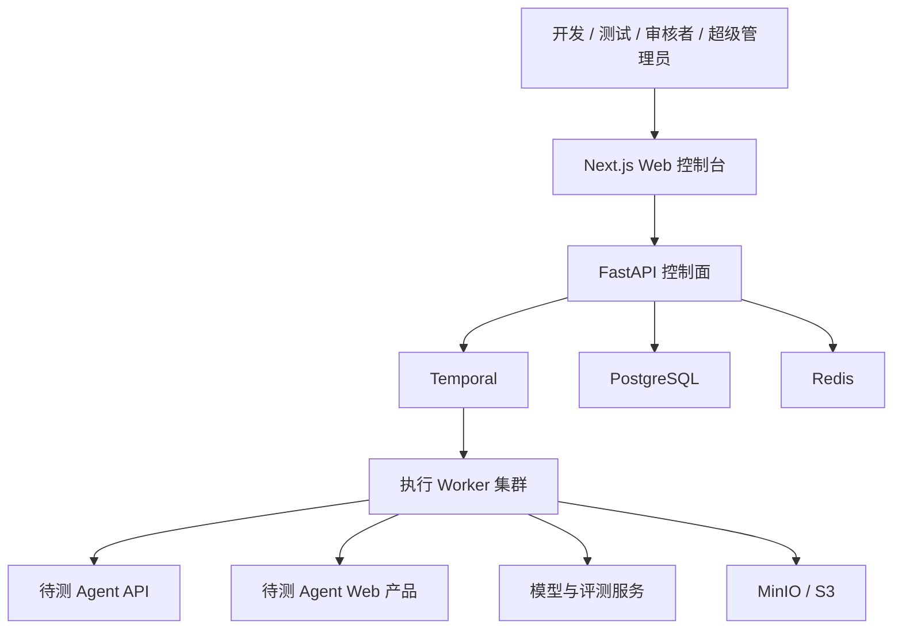

# Agent 测试平台技术架构与开发规范

| 文档信息 | 内容 |
|---|---|
| 文档版本 | V1.0 |
| 文档日期 | 2026-06-25 |
| 适用范围 | Agent 测试平台前端、后端、数据库、Worker、插件与基础设施 |
| 架构目标 | 可维护、可测试、可扩展、可观测、可逐步拆分 |

仓库开发工作必须同时遵守根目录 `AGENTS.md`，并在 `docs/开发进度与变更记录.md` 中维护任务、验证和交接记录。

---

## 1. 架构结论

平台采用：

> 模块化单体控制面 + 独立执行 Worker + 可靠工作流编排 + 插件化领域扩展

核心决策：

1. Web 控制台使用 Next.js、React 和 TypeScript。
2. 控制面后端使用 FastAPI、Python、SQLAlchemy 和 PostgreSQL。
3. 长任务直接使用 Temporal 编排，不在核心业务中混用多套任务系统。
4. 浏览器执行器、API 执行器、评测器和安全扫描器作为独立 Worker 部署。
5. PostgreSQL 是业务事实来源，Redis 只用于缓存、限流和短期协调。
6. MinIO/S3 保存截图、录像、Trace 文件和多媒体产物。
7. OpenTelemetry 贯穿前端、API、Workflow 和 Worker。
8. 通用能力通过稳定接口扩展，画布 Agent 作为第一个插件实现。
9. 首版不拆微服务；当模块出现独立扩缩容、发布或团队边界时再拆分。

---

## 2. 架构原则

### 2.1 业务模块优先

代码按业务能力组织，不按 Controller、Service、Model 建立全局技术大目录。Agent、数据集、运行、评测、安全等模块必须拥有自己的领域、应用、接口和持久化实现。

### 2.2 依赖方向稳定

统一依赖方向：

```text
API / Worker / CLI
        ↓
Application
        ↓
Domain

Infrastructure → 实现 Domain 或 Application 定义的接口
```

- Domain 不依赖 FastAPI、SQLAlchemy、Temporal、Redis 和第三方 SDK。
- Application 不直接执行 SQL，不直接调用外部厂商 SDK。
- API 层不写业务规则。
- ORM 实体不直接作为 API 响应。
- 模块之间通过公开 Application 接口或领域事件协作。

### 2.3 默认模块化单体

早期业务规则和边界仍会变化，控制面采用单体部署可以降低分布式事务、版本协调和运维成本。

独立 Worker 不等于微服务。Worker 是执行隔离和扩缩容边界，控制面仍保持统一业务模型和数据库事务。

### 2.4 状态显式化

测试计划、运行、用例运行、评审和门禁必须使用明确状态机，禁止用多个布尔字段组合推断状态。

### 2.5 扩展通过契约而不是条件分支

新增 Agent 类型时，实现 Adapter、Artifact 和 Scorer 插件。禁止在核心流程中不断增加：

```python
if agent_type == "canvas":
    ...
elif agent_type == "customer_service":
    ...
```

### 2.6 可靠性优先

- 所有长任务可恢复、可取消、可重试。
- 所有外部调用设置超时。
- 所有命令支持幂等。
- 数据写入与事件发布使用 Outbox。
- 失败、错误和取消是不同状态。

---

## 3. 系统上下文



---

## 4. 逻辑分层

### 4.1 控制面

负责：

- 登录、用户、角色和项目权限。
- Agent、数据集、用例和测试计划。
- 创建实验和运行。
- 查询进度与结果。
- 人工审核。
- 发布门禁。
- 审计日志。
- 插件注册与配置。

控制面不得直接启动浏览器或执行长时间模型评分。

### 4.2 工作流编排层

Temporal 负责：

- 环境准备。
- 批量用例分发。
- API 或浏览器执行。
- Artifact 收集。
- 断言、评测和安全扫描。
- 人工审核等待。
- 汇总和门禁计算。
- 超时、重试、取消和断点恢复。

Workflow 只负责编排。具体浏览器、评测和业务操作由 Activity 调用 Worker 内的应用服务完成。

### 4.3 执行面

独立 Worker：

| Worker | 职责 |
|---|---|
| API Runner | 调用待测 Agent API、多轮会话和状态轮询 |
| Model Runner | 解密项目模型短期凭证并调用 OpenAI-Compatible 模型服务 |
| Playwright Runner | 确定性浏览器回归和证据采集 |
| Browser Harness Runner | 探索测试、路径发现和修复候选 |
| Evaluation Runner | 规则、DeepEval、多模态和参考结果评分 |
| Security Runner | Promptfoo、策略引擎及后续 PyRIT/Garak |
| Artifact Processor | 图片缩略图、视频关键帧、文件元数据和脱敏 |

每类 Worker 使用独立队列和资源限制，可以单独扩容。

执行 Worker 不直接连接业务数据库。小型结构化结果通过 Temporal Activity 返回；大型产物先上传对象存储，再返回 Artifact Descriptor，由控制面的持久化 Activity 写入 PostgreSQL。

### 4.4 数据面

- PostgreSQL：业务元数据、配置、状态、索引和结构化结果。
- MinIO/S3：截图、录像、Trace、图片、视频和大型日志。
- Redis：缓存、限流、短期锁和短期进度，不保存唯一事实。
- OpenTelemetry Backend：Trace、Metric 和 Log 查询。

---

## 5. Monorepo 目录

```text
agenttest/
├── apps/
│   ├── web/                         # Next.js Web 控制台
│   ├── control-api/                 # FastAPI 控制面
│   └── admin-cli/                   # 初始化超级管理员、维护命令
├── workers/
│   ├── api-runner/
│   ├── playwright-runner/
│   ├── browser-harness-runner/
│   ├── evaluation-runner/
│   ├── security-runner/
│   └── artifact-processor/
├── packages/
│   ├── contracts/                   # OpenAPI、事件和插件契约
│   ├── plugin-sdk-python/
│   ├── plugin-sdk-typescript/
│   ├── generated-api-client/
│   ├── eslint-config/
│   ├── typescript-config/
│   └── test-fixtures/
├── plugins/
│   ├── generic-http-agent/
│   ├── generic-web-agent/
│   └── canvas-agent/
├── infra/
│   ├── compose/
│   ├── kubernetes/
│   ├── temporal/
│   ├── observability/
│   └── database/
├── docs/
│   ├── adr/                         # 架构决策记录
│   ├── api/
│   ├── runbooks/
│   └── security/
├── scripts/
├── .github/workflows/
├── Makefile
├── package.json
├── pyproject.toml
└── README.md
```

### 5.1 仓库规则

- JavaScript/TypeScript 使用 pnpm Workspace。
- Python 使用 uv Workspace 或统一 `pyproject.toml` 管理。
- 根目录命令统一封装在 Makefile 或 Task Runner。
- 共享代码必须进入 `packages`，禁止跨应用使用相对路径读取源码。
- 前端不能直接依赖 Python 包；通过 OpenAPI 或事件契约共享类型。
- Worker 不导入 FastAPI 路由层。
- 插件不导入平台内部模块，只依赖公开 Plugin SDK。

---

## 6. 前端架构

### 6.1 技术栈

- Next.js App Router
- React
- TypeScript Strict
- Tailwind CSS
- Radix UI + shadcn/ui 结构
- TanStack Query
- TanStack Table
- React Hook Form + Zod
- ECharts
- React Flow
- Playwright
- Vitest + Testing Library
- Storybook

### 6.2 前端目录

```text
apps/web/
├── src/
│   ├── app/
│   │   ├── (auth)/
│   │   │   └── login/
│   │   ├── (platform)/
│   │   │   ├── layout.tsx
│   │   │   ├── projects/[projectId]/
│   │   │   │   ├── overview/
│   │   │   │   ├── test-agent/
│   │   │   │   ├── agents/
│   │   │   │   ├── datasets/
│   │   │   │   ├── plans/
│   │   │   │   ├── runs/
│   │   │   │   ├── experiments/
│   │   │   │   ├── security/
│   │   │   │   ├── reviews/
│   │   │   │   ├── scorers/
│   │   │   │   ├── environments/
│   │   │   │   ├── gates/
│   │   │   │   └── settings/
│   │   │   └── system/
│   │   │       ├── users/
│   │   │       └── audit/
│   │   └── api/                     # 仅必要的 BFF/代理路由
│   ├── features/
│   │   ├── auth/
│   │   ├── projects/
│   │   ├── agents/
│   │   ├── datasets/
│   │   ├── test-plans/
│   │   ├── runs/
│   │   ├── evaluations/
│   │   ├── security/
│   │   ├── reviews/
│   │   └── test-agent-chat/
│   ├── components/
│   │   ├── ui/
│   │   ├── layout/
│   │   ├── data-display/
│   │   └── agent-testing/
│   ├── lib/
│   │   ├── api/
│   │   ├── auth/
│   │   ├── permissions/
│   │   ├── telemetry/
│   │   ├── formatting/
│   │   └── validation/
│   ├── hooks/
│   ├── styles/
│   ├── test/
│   └── types/
├── public/
├── playwright/
└── package.json
```

### 6.3 Feature 目录规范

```text
features/runs/
├── api/                     # Query/Mutation 和 DTO 转换
├── components/              # 仅 runs 领域使用的组件
├── hooks/
├── model/                   # 前端领域模型、状态与选择器
├── schemas/                 # Zod 表单和 URL Schema
├── utils/
├── tests/
└── index.ts                 # 公开出口
```

- Feature 外部只能从 `index.ts` 导入。
- Feature 之间禁止读取对方内部文件。
- 页面只负责组合 Feature，不写复杂业务规则。
- 公共组件不得依赖具体 Feature。

### 6.4 数据流

```text
Server Component 首屏数据
        ↓
Generated API Client
        ↓
TanStack Query 客户端刷新
        ↓
Feature View Model
        ↓
UI Component
```

- URL 保存可分享状态：项目、分页、筛选、标签页和选中项。
- 服务端状态由 TanStack Query 管理。
- 表单状态由 React Hook Form 管理。
- 仅真正跨页面、非服务端、非 URL 状态使用轻量全局 Store。
- 禁止将 API DTO 原样散布到所有组件，复杂页面需要 View Model 转换。

### 6.5 前端权限

- 权限定义集中在 `lib/permissions`。
- 菜单、路由、按钮和请求使用同一权限枚举。
- 前端权限仅改善体验，后端始终重新校验。
- 超级管理员页面位于 `/system`，普通用户访问返回无权限页。
- 项目路由加载前验证成员关系。

### 6.6 前端质量门禁

合并前必须通过：

```text
format
lint
typecheck
unit test
component test
critical Playwright E2E
build
bundle budget
```

公共组件必须提供：

- 默认、Hover、Focus、Disabled、Loading、Error 状态。
- 键盘和无障碍行为。
- Storybook 示例。
- 组件测试。

---

## 7. 后端架构

### 7.1 技术栈

- Python
- FastAPI
- Pydantic
- SQLAlchemy 2
- Alembic
- PostgreSQL
- Temporal Python SDK
- Redis
- OpenTelemetry
- Pytest
- Ruff
- mypy 或 pyright

### 7.2 控制面目录

```text
apps/control-api/
├── src/agenttest/
│   ├── main.py
│   ├── bootstrap/
│   │   ├── app.py
│   │   ├── container.py
│   │   ├── settings.py
│   │   └── telemetry.py
│   ├── shared/
│   │   ├── domain/
│   │   ├── application/
│   │   ├── infrastructure/
│   │   └── api/
│   ├── modules/
│   │   ├── identity/
│   │   ├── projects/
│   │   ├── agents/
│   │   ├── datasets/
│   │   ├── test_plans/
│   │   ├── experiments/
│   │   ├── runs/
│   │   ├── evaluations/
│   │   ├── security/
│   │   ├── reviews/
│   │   ├── release_gates/
│   │   ├── plugins/
│   │   └── audit/
│   └── entrypoints/
│       ├── http/
│       ├── temporal/
│       └── cli/
├── tests/
│   ├── unit/
│   ├── integration/
│   ├── contract/
│   └── architecture/
├── migrations/
└── pyproject.toml
```

### 7.3 单个后端模块目录

```text
modules/runs/
├── domain/
│   ├── entities.py
│   ├── value_objects.py
│   ├── events.py
│   ├── policies.py
│   ├── repositories.py
│   └── errors.py
├── application/
│   ├── commands/
│   ├── queries/
│   ├── handlers/
│   ├── dto.py
│   └── ports.py
├── infrastructure/
│   ├── persistence/
│   │   ├── models.py
│   │   ├── repositories.py
│   │   └── mappers.py
│   ├── temporal/
│   └── integrations/
├── api/
│   ├── router.py
│   ├── schemas.py
│   └── dependencies.py
└── public.py
```

模块公开能力仅从 `public.py` 暴露。禁止跨模块直接导入对方的 ORM、Repository 或内部 Handler。

### 7.4 Domain 层规范

- Entity 维护业务不变量。
- Value Object 不可变并在创建时校验。
- Domain Service 只承载无法自然归属单个 Entity 的业务规则。
- Repository 只在 Domain 或 Application 定义接口。
- Domain Event 使用过去时命名，例如 `RunCreated`、`UserDisabled`。
- Domain 层不出现 HTTP、SQL、JSON、Redis 和 SDK 概念。

### 7.5 Application 层规范

- Command 改变状态，Query 只读取状态。
- 一个 Handler 对应一个明确用例。
- Handler 负责事务边界、权限校验、Repository 协作和事件记录。
- 外部能力通过 Port 接口调用。
- Application 返回 DTO，不返回 ORM Entity。
- 禁止在 Handler 中构造大型条件分支处理不同 Agent 类型，应调用插件注册表。

### 7.6 API 层规范

- API 前缀统一为 `/api/v1`。
- 资源使用复数名词和标准 HTTP 方法。
- 命令型复杂操作使用明确子资源，例如：

```text
POST /api/v1/projects/{project_id}/test-plans/{plan_id}/runs
POST /api/v1/runs/{run_id}/cancel
POST /api/v1/review-tasks/{task_id}/decisions
```

- 错误响应采用 RFC 7807 Problem Details。
- 请求使用 Pydantic Schema 校验。
- 分页列表默认使用 Cursor Pagination。
- 创建运行等可重试请求支持 `Idempotency-Key`。
- 并发编辑使用版本号或 `updated_at` 做乐观锁。
- 实时进度优先使用 SSE；双向协作场景才使用 WebSocket。
- 不在 URL、日志或错误信息中暴露凭证。

### 7.7 身份认证与会话

- 使用服务端可撤销 Session，不使用长期不可撤销 JWT 作为浏览器主会话。
- 浏览器仅保存随机 Session Token 的 Secure、HttpOnly、SameSite Cookie。
- 数据库保存 Token Hash、用户、过期时间和撤销时间。
- 密码使用 Argon2id。
- 登录、密码重置和敏感写操作实施限流。
- Cookie 会话的写操作必须有 CSRF 防护。
- 用户禁用、密码重置或主动注销全部会话后立即撤销 Session。

### 7.8 权限模型

权限分两层：

1. 系统角色：超级管理员、开发、测试、审核者、只读。
2. 项目成员关系：决定普通用户可以访问哪些项目。

统一权限检查：

```text
Authenticated
→ System Role
→ Project Membership
→ Resource Project ID
→ Action Permission
```

禁止 Controller 自行拼装权限逻辑。权限 Policy 必须集中定义并有参数化测试。

### 7.9 事务与事件

- 一个 Application Command 对应一个数据库事务。
- 数据写入和 Outbox Event 在同一事务提交。
- 独立 Publisher 将 Outbox 可靠发送给 Temporal 或事件消费者。
- Consumer 必须幂等，使用 `event_id` 去重。
- 不在数据库事务中等待模型、浏览器或外部 API。
- 跨模块同步校验通过公开 Query 接口完成，异步副作用使用事件。

---

## 8. 数据库架构

### 8.1 PostgreSQL 设计原则

- PostgreSQL 是唯一业务事实来源。
- 表名、列名使用 `snake_case`。
- 主键统一 UUID，由应用层生成。
- 时间统一使用 `timestamptz`，保存 UTC。
- 金额使用整数最小单位或 `numeric`，禁止浮点数。
- Token 数量、持续时间和评分使用明确单位。
- JSONB 只用于变化频繁的插件配置和原始快照，核心查询字段必须结构化。
- 外键默认存在，删除策略必须显式定义。
- 关键业务表必须包含 `created_at` 和 `updated_at`。
- 需要审计的记录保存 `created_by` 和 `updated_by`。

### 8.2 Schema 组织

首版使用一个 PostgreSQL Database，并按用途分 Schema：

```text
public       # 核心业务表
audit        # 审计事件
workflow     # Outbox、幂等和工作流映射
```

不为每个模块创建独立 Database，避免过早引入分布式事务。

### 8.3 核心表分组

#### 身份与权限

```text
users
user_credentials
user_sessions
projects
project_members
```

#### Agent 与插件

```text
agents
agent_versions
plugin_definitions
plugin_versions
plugin_installations
environment_templates
credentials
```

#### 测试资产

```text
datasets
dataset_versions
test_cases
test_case_versions
test_plans
test_plan_versions
```

#### 执行与结果

```text
experiments
runs
run_cases
traces
artifacts
assertion_results
score_results
security_findings
```

#### 协作与发布

```text
review_tasks
review_decisions
release_gates
release_gate_evaluations
saved_views
drafts
```

#### 系统可靠性

```text
audit.audit_logs
workflow.outbox_events
workflow.idempotency_keys
workflow.workflow_instances
```

### 8.4 项目隔离

所有项目业务表直接或可验证地关联 `project_id`。

- Repository 查询必须接收 `project_id`。
- 禁止使用仅按资源 ID 查询项目资源的通用方法。
- 唯一约束包含项目维度，例如 `(project_id, name)`。
- 高频访问索引通常以 `project_id` 开头。
- 对象存储 Key 使用项目前缀，但不能以路径前缀替代授权校验。
- 可启用 PostgreSQL Row Level Security 作为纵深防御；应用层权限校验仍然保留。

推荐 Repository 方法：

```python
get_by_id(project_id: UUID, run_id: UUID) -> Run | None
```

禁止：

```python
get_by_id(run_id: UUID) -> Run | None
```

### 8.5 版本化与不可变数据

- DatasetVersion、TestCaseVersion、TestPlanVersion、AgentVersion 发布后不可修改。
- 编辑已发布资产时创建新版本。
- Run 必须引用确切版本，不引用“最新版本”。
- 评分器模型、Prompt 和配置同样保存版本快照。
- 原始 Trace 和 Artifact 元数据不得被后续运行覆盖。

### 8.6 删除策略

- 用户有历史数据时只禁用，不物理删除。
- 项目、Agent、数据集和测试计划默认软归档。
- Session、幂等记录和临时数据按保留策略清理。
- 大型 Artifact 删除需先写审计，再异步删除对象存储文件。
- 禁止通用 Repository 自动级联删除业务数据。

### 8.7 索引规范

每个索引必须由查询场景驱动。基础索引包括：

- 项目资源：`(project_id, created_at desc)`。
- 运行查询：`(project_id, status, created_at desc)`。
- 用例结果：`(run_id, status)`。
- 审核队列：`(project_id, status, priority, created_at)`。
- Outbox：`(published_at, created_at)` 的条件索引。
- Session：Token Hash 唯一索引和过期时间索引。

禁止为所有外键和 JSONB 字段盲目建立索引。慢查询通过 `EXPLAIN ANALYZE` 验证后优化。

### 8.8 数据库迁移

- 所有 Schema 变更通过 Alembic。
- 迁移文件提交后不可改写。
- 生产迁移遵循 Expand → Migrate → Contract。
- 新增非空列先允许空值或提供安全默认值，再回填，最后收紧约束。
- 大表索引使用不阻塞写入的方式创建。
- 应用发布必须向后兼容至少一个迁移阶段。
- CI 在空数据库和上一版本数据库上验证迁移。

---

## 9. Worker 架构

### 9.1 Worker 通用目录

```text
workers/playwright-runner/
├── src/
│   ├── main.ts
│   ├── activities/
│   ├── application/
│   ├── adapters/
│   ├── artifacts/
│   ├── telemetry/
│   └── config/
├── tests/
├── Dockerfile
└── package.json
```

Python Worker 使用对应的 `src/<package>` 和 `tests` 结构。

### 9.2 Worker 约束

- Worker 无权访问与当前任务无关的项目数据。
- 任务载荷只传 ID 和短期授权，不传大量业务快照。
- Worker 从控制面受控接口获取任务上下文。
- Worker 不持有业务数据库账号，不直接写入 PostgreSQL。
- 结构化结果通过 Temporal 返回或提交到受认证的内部结果接口。
- 每个 Activity 设置 Start-to-Close Timeout 和 Retry Policy。
- 非幂等动作必须使用业务幂等键。
- Worker 定期发送 Heartbeat，支持取消。
- 浏览器、外部文件和插件运行在隔离容器。
- Worker 退出前上传必要证据并报告明确错误类型。

### 9.3 错误分类

```text
ValidationError       # 测试配置错误，不重试
PermissionError       # 权限或凭证错误，不重试
EnvironmentError      # 环境准备失败，有限重试
TargetProductError    # 待测产品错误，记录为测试结果
TransientError        # 网络或临时依赖错误，可重试
PlatformError         # 平台自身缺陷，需要告警
CancelledError        # 用户取消
```

---

## 10. 插件架构

### 10.1 插件边界

插件只能依赖公开 SDK，不能：

- 访问平台 ORM。
- 直接查询平台数据库。
- 导入控制面内部模块。
- 自行修改运行状态。
- 获得平台全局凭证。

### 10.2 插件清单

```yaml
id: canvas-agent
name: Canvas Agent
version: 1.0.0
sdk_version: 1
capabilities:
  - agent_adapter
  - environment_adapter
  - artifact_adapter
  - scorer
config_schema: schemas/config.json
```

### 10.3 核心接口

```python
class AgentAdapter(Protocol):
    async def start(self, context: RunContext, input: AgentInput) -> ExecutionHandle: ...
    async def wait(self, handle: ExecutionHandle) -> AgentExecutionResult: ...
    async def cancel(self, handle: ExecutionHandle) -> None: ...

class EnvironmentAdapter(Protocol):
    async def prepare(self, context: RunContext, spec: EnvironmentSpec) -> EnvironmentHandle: ...
    async def cleanup(self, handle: EnvironmentHandle) -> None: ...

class ArtifactAdapter(Protocol):
    async def collect(self, context: RunContext) -> list[ArtifactDescriptor]: ...

class ScorerPlugin(Protocol):
    async def score(self, context: ScoreContext) -> ScoreResult: ...
```

### 10.4 插件兼容性

- SDK 使用独立语义版本。
- Manifest 声明支持的 SDK 范围。
- 插件配置由 JSON Schema 校验。
- 插件升级不自动修改已发布测试计划。
- Run 保存插件 ID、版本和配置快照。
- 不可信插件使用独立进程或容器运行。

---

## 11. API 与事件契约

### 11.1 契约来源

- HTTP API：OpenAPI 是唯一事实来源。
- 前端 Client：由 OpenAPI 自动生成。
- 内部事件：JSON Schema 或 Protobuf，并保存在 `packages/contracts`。
- Plugin DTO：由 Plugin SDK 定义。

### 11.2 兼容性

- `/api/v1` 内只做向后兼容变更。
- 新字段默认为可选，客户端忽略未知字段。
- 删除或改变语义必须发布新 API 版本。
- Event Schema 增加 `event_type`、`event_version`、`event_id`、`occurred_at`。
- Consumer 必须兼容至少当前和前一个事件版本。

### 11.3 标准事件信封

```json
{
  "event_id": "uuid",
  "event_type": "run.completed",
  "event_version": 1,
  "occurred_at": "2026-06-25T10:00:00Z",
  "project_id": "uuid",
  "correlation_id": "uuid",
  "causation_id": "uuid",
  "payload": {}
}
```

---

## 12. 工作流设计

### 12.1 运行工作流

```text
CreateRun
→ ValidateConfiguration
→ PrepareEnvironment
→ FanOutRunCases
    → ExecuteAgent
    → CollectTrace
    → CollectArtifacts
    → EvaluateAssertions
    → EvaluateScorers
    → EvaluateSecurityPolicies
→ AggregateExperiment
→ CreateReviewTasks
→ WaitForRequiredReviews
→ EvaluateReleaseGate
→ CompleteRun
→ CleanupEnvironment
```

### 12.2 工作流规范

- Workflow 代码必须确定性。
- 当前时间、随机数和外部 I/O 只能在 Activity 中获取。
- 大批量用例分片执行，避免单个 Workflow 历史无限增长。
- 50–500 条用例使用 Child Workflow 或批次聚合。
- 人工审核通过 Signal 恢复。
- 运行取消必须触发环境清理。
- 清理失败进入补偿队列并告警，不能阻塞结果查询。

---

## 13. 可观测性

### 13.1 Trace

统一传播：

```text
HTTP Request
→ Application Command
→ Temporal Workflow
→ Activity
→ Worker
→ 待测 Agent / 模型 / 浏览器
```

关键字段：

- `trace_id`
- `correlation_id`
- `project_id`
- `run_id`
- `run_case_id`
- `agent_version_id`
- `worker_type`

### 13.2 日志

- 使用结构化 JSON 日志。
- 禁止字符串拼接输出大对象。
- 日志包含时间、级别、服务、环境和关联 ID。
- 密码、Cookie、Authorization、API Key 和敏感内容必须脱敏。
- 用户可见 Trace 与平台运维日志分开保存。

### 13.3 指标

平台指标：

- API 延迟、错误率和饱和度。
- Workflow 成功率、重试和任务积压。
- Worker 并发、利用率和崩溃。
- 数据库连接、锁、慢查询和容量。
- 对象存储错误和带宽。

业务指标：

- 运行成功率。
- 用例通过、失败和错误率。
- 平均成本、Token 和耗时。
- 安全发现数量。
- 人工审核积压。

---

## 14. 安全架构

### 14.1 Secret 管理

- 本地开发可使用受控 `.env`，禁止提交仓库。
- 部署环境使用 Secret Manager 或 Kubernetes Secret。
- 项目凭证加密保存，使用 Envelope Encryption。
- 解密只发生在授权 Worker 的短生命周期内。
- UI 和普通 API 永不返回凭证明文。
- Control API 只向 Model Runner 传递最小加密配置快照；模型调用缺少项目默认配置时必须失败，禁止使用 Mock 或供应商 API Key 环境变量回退。

### 14.2 网络边界

- Control API 不向公网暴露数据库、Redis、Temporal 和 Worker 管理端口。
- Worker 出站访问按目标白名单限制。
- Browser Worker 使用独立网络和临时用户目录。
- 插件和待测文件在沙箱内处理。
- SSRF 防护覆盖 URL 验证、DNS 重绑定和内网地址限制。

### 14.3 供应链

- 锁定依赖版本并提交 Lockfile。
- CI 执行依赖漏洞、许可证和 Secret 扫描。
- 容器使用最小基础镜像和非 Root 用户。
- 生成 SBOM。
- 第三方插件安装前验证来源、版本和权限。

---

## 15. 测试架构

### 15.1 测试金字塔

```text
少量 E2E
适量 Contract / Integration
大量 Unit / Domain
```

### 15.2 后端测试

- Domain：实体不变量、状态机和 Policy。
- Application：Command/Query Handler 与权限。
- Repository：使用真实 PostgreSQL 测试。
- API：认证、授权、Schema 和错误契约。
- Architecture Test：禁止反向依赖和跨模块内部导入。
- Migration Test：空库升级和旧版本升级。

### 15.3 前端测试

- Unit：格式化、权限和 View Model。
- Component：表单、表格、状态和对话卡片。
- Contract：生成 Client 与 API Schema。
- Visual：核心页面和组件。
- E2E：登录、项目切换、创建计划、运行、分析和审核。

### 15.4 Worker 测试

- Adapter 使用 Fake Target 测试。
- Temporal Workflow 使用时间跳跃和 Activity Mock。
- Playwright 使用专用测试站点。
- 插件执行验证超时、取消、重试和隔离。
- Artifact 上传验证中断恢复和幂等。

### 15.5 生产真实性门禁

- 测试目录允许 Fake Target、Activity Mock 和协议夹具；生产源码只允许用户显式启用的网络 Mock/故障注入模块。
- 可选运行时缺失必须返回可分类错误，禁止构造通过、跳过、空发现或中性分数。
- 报告、会话、任务与生成资产使用 PostgreSQL 事实源并强制校验 `project_id`。
- CI 扫描自动 Mock 工厂、演示业务响应、进程内事实源、重复运行时地址和浮动容器镜像。

---

## 16. 配置与环境

### 16.1 环境

```text
local
test
staging
production
```

- 配置通过环境变量注入。
- 启动时使用强类型 Settings 校验。
- 环境差异不得通过代码分支硬编码。
- Staging 尽量与 Production 拓扑一致。
- 测试环境使用独立数据库、对象存储 Bucket 和凭证。

### 16.2 Feature Flag

- 未完成能力使用服务端 Feature Flag 控制。
- Flag 有负责人、创建时间和清理日期。
- 权限控制不能使用 Feature Flag 代替。
- 影响数据格式的 Flag 必须考虑双读或兼容期。

---

## 17. CI/CD 规范

### 17.1 Pull Request

必须通过：

- 格式化与静态检查。
- TypeScript 和 Python 类型检查。
- 单元、组件和集成测试。
- OpenAPI Breaking Change 检查。
- 数据库迁移检查。
- 架构依赖检查。
- 依赖、许可证和 Secret 扫描。
- 容器构建。

### 17.2 发布

- 前端、Control API 和各 Worker 独立构建镜像。
- 镜像使用 Git Commit 和语义版本标记。
- 数据库迁移作为受控发布步骤。
- 先部署向后兼容代码，再执行收紧型迁移。
- 支持快速回滚应用，不依赖回滚破坏性数据库迁移。
- Worker 滚动升级时兼容仍在运行的 Workflow。

---

## 18. 开源框架版本与更新规范

### 18.1 基本原则

集成开源框架时采用：

> 拉取当时最新稳定版 → 完成许可证和兼容性检查 → 锁定精确版本 → 通过测试后发布

“使用最新版本”不等于运行时持续跟随 `latest`：

- 禁止生产环境引用 GitHub `main`、未固定 Commit、`latest` 镜像标签或宽泛通配版本。
- 禁止默认使用 Alpha、Beta、RC、Nightly 和 Experimental 版本。
- 安装时从项目官方仓库、官方包仓库或官方容器仓库获取。
- Lockfile 和容器 Digest 必须提交仓库。
- 构建必须可根据 Commit 和 Lockfile 重现。
- 每次升级必须独立提交或 Pull Request，禁止与无关业务改动混合。

### 18.2 2026-06-25 调研基线

以下版本用于架构调研，不代表未来实施时永久固定。正式开始开发或接入某个框架时，必须再次读取其官方 Release、迁移说明和许可证，并选择当时最新稳定版。

| 框架 | 2026-06-25 核对到的稳定版本 | 使用位置 |
|---|---:|---|
| DeepEval | 4.0.5 | Agent 评测和 LLM-as-a-Judge |
| Playwright | 1.61.1 | 确定性浏览器回归 |
| Browser Harness | 0.1.3 | 探索测试和修复候选 |
| Promptfoo | 0.121.17 | 基础红队和安全扫描 |
| Temporal Python SDK | 1.29.0 | 工作流和 Activity |
| Microsoft PyRIT | 0.14.0 | 高级多轮红队，第二阶段 |
| NVIDIA Garak | 0.15.1 | 通用漏洞扫描，第二阶段 |
| AgentDojo | 0.1.35 | 间接注入场景参考，第二阶段 |

对于 Browser Harness、PyRIT、Garak 和 AgentDojo 等 `0.x` 项目，升级默认视为可能包含破坏性变更，即使只变化 Minor 或 Patch 版本。

### 18.3 引入检查清单

每个开源框架首次引入前必须记录：

- 官方仓库和官方包地址。
- 当前最新稳定 Release 和发布日期。
- License 类型、License 文件和商业使用限制。
- 项目活跃度、维护者、Issue 和安全公告。
- 支持的语言、运行时和操作系统版本。
- 必需权限、网络访问、遥测和数据上传行为。
- 传递依赖和已知 CVE。
- 与平台 Python、Node.js、浏览器和数据库版本的兼容性。
- 升级和回滚方案。
- 替代方案和退出成本。

结论保存为 ADR 或 `docs/security/dependencies/<framework>.md`。

### 18.4 锁定方式

#### Node.js

- `package.json` 使用明确版本范围；关键执行框架优先固定精确版本。
- `pnpm-lock.yaml` 必须提交。
- CI 使用 Frozen Lockfile。
- Playwright npm 包版本与浏览器镜像版本保持一致。
- Docker 镜像使用不可变 Digest。

#### Python

- `pyproject.toml` 声明兼容范围。
- `uv.lock` 必须提交。
- 生产和 Worker 镜像根据 Lockfile 安装。
- 从 Git 安装时固定 Release Tag 和 Commit SHA，不能仅固定分支名。

#### 容器和基础设施

- Temporal、PostgreSQL、Redis、MinIO 和 OpenTelemetry 组件使用明确版本。
- 生产镜像除版本标签外同时固定 Digest。
- Kubernetes Chart 固定 Chart 版本和应用版本。

### 18.5 自动更新

- 使用 Renovate 或 Dependabot 每周检查稳定版本。
- Patch 更新可自动创建 PR，但不能自动合并核心执行框架。
- Minor 和 Major 更新必须人工阅读 Release Notes。
- 安全修复根据严重程度触发加急升级。
- 预发布版本只允许在独立实验分支和隔离环境验证。
- Browser Harness 等早期项目采用更严格的人工审查。

### 18.6 兼容性测试矩阵

核心框架升级必须通过：

```text
Control API Contract Tests
Plugin SDK Compatibility Tests
Temporal Workflow Replay Tests
Playwright Browser Matrix
Browser Harness Golden Task Tests
DeepEval Metric Snapshot Tests
Promptfoo Security Baseline Tests
Artifact Compatibility Tests
Critical End-to-End Tests
```

额外要求：

- Temporal SDK 升级必须重放已有 Workflow History。
- Playwright 升级必须验证 Chromium，并抽测 Firefox/WebKit。
- DeepEval 升级必须检查指标语义和分数漂移，不仅检查代码是否运行。
- Promptfoo、PyRIT 和 Garak 升级必须检查漏洞分类、严重度和报告 Schema。
- Browser Harness 升级必须使用固定任务集比较成功率、步骤数、成本和轨迹差异。

### 18.7 发布与回滚

- 框架升级先进入 Staging。
- 使用固定回归集和安全基线进行对比。
- 关键分数、成功率、成本或延迟明显退化时禁止发布。
- 保留上一稳定镜像和 Lockfile。
- 数据格式变化采用双读或迁移，不允许依赖简单降级代码解决。
- 每次运行保存实际框架版本、镜像 Digest、插件版本和浏览器版本。

### 18.8 许可证与供应链

- CI 生成 SBOM。
- CI 执行许可证、CVE、恶意包和 Secret 扫描。
- 不满足许可证要求的依赖不得进入主分支。
- Release Artifact 必须具有来源证明和校验值。
- 优先使用官方签名 Release、Verified Commit 和可信包仓库。
- 框架默认遥测必须核实；涉及测试数据或模型内容时默认关闭，除非明确批准。

---

## 19. 扩展与拆分策略

### 19.1 何时拆服务

满足以下一项以上再考虑从控制面拆分：

- 模块需要独立高频发布。
- 模块有明显不同的扩缩容模型。
- 模块由独立团队长期负责。
- 单体部署导致资源或故障相互影响。
- 数据合规要求强制独立存储。

优先拆分候选：

1. Artifact Processing。
2. Evaluation。
3. Security Scanning。
4. Browser Execution Gateway。

Identity、Project、Dataset 和 Test Plan 在早期保持同一控制面。

### 19.2 拆分前提

- 模块已有公开 Application API。
- 模块内部数据没有被其他模块直接查询。
- 事件契约稳定。
- 分布式一致性方案明确。
- 可观测性和运维能力已经具备。

---

## 20. 禁止事项

- 禁止业务 Controller 直接操作 ORM。
- 禁止跨模块直接读取数据库表或 ORM Model。
- 禁止把 PostgreSQL 当消息队列轮询长任务，Outbox Publisher 除外。
- 禁止 Redis 保存唯一业务状态。
- 禁止 Worker 直接修改不属于其任务的运行状态。
- 禁止 API 返回数据库 Entity。
- 禁止前端手写与 OpenAPI 重复的 DTO。
- 禁止核心查询依赖无结构 JSONB。
- 禁止发布后原地修改数据集、用例和计划版本。
- 禁止插件直接访问主数据库。
- 禁止在测试运行中静默修改共享 Browser Harness Skill。
- 禁止在日志中输出密码、Token、Cookie、凭证和未脱敏敏感数据。
- 禁止没有超时、取消和幂等设计的外部调用。
- 禁止生产依赖使用浮动 `latest`、未固定 Git 分支或未提交 Lockfile。
- 禁止未经许可证、安全和兼容性检查直接引入新框架。

---

## 21. 架构验收标准

### 21.1 前端

- Feature 之间无内部路径交叉导入。
- OpenAPI Client 自动生成。
- TypeScript Strict、Lint、测试和 Build 通过。
- 核心页面具备权限、空、错误和加载状态。

### 21.2 后端

- Domain 不依赖框架和基础设施。
- 模块只通过 `public.py` 或事件协作。
- API 不直接操作 ORM。
- 所有项目资源查询包含 `project_id`。
- 身份、权限和状态机具有自动测试。

### 21.3 数据库

- 所有 Schema 由 Alembic 管理。
- 已发布资产使用不可变版本。
- 关键查询有明确索引和执行计划验证。
- 项目隔离、审计和凭证保护通过集成测试。

### 21.4 Worker 与工作流

- 长任务支持重试、取消和恢复。
- Worker 可独立扩缩容。
- Activity 有超时、心跳和错误分类。
- 同一幂等键不会产生重复业务副作用。

### 21.5 插件

- 画布插件只依赖 Plugin SDK。
- 插件版本和配置快照随 Run 保存。
- 新增一个通用 Agent 插件不需要修改核心运行流程。
- 核心依赖具有 Lockfile、版本清单、许可证记录和升级回归结果。

---

## 22. 架构决策记录

后续重要决策必须写入 `docs/adr`，至少包括：

- ADR-001：采用模块化单体控制面。
- ADR-002：采用 Temporal 编排长任务。
- ADR-003：使用服务端 Session Cookie。
- ADR-004：项目内共享、项目间隔离。
- ADR-005：Playwright 回归与 Browser Harness 探索双引擎。
- ADR-006：插件只能依赖公开 SDK。
- ADR-007：发布资产采用不可变版本。
- ADR-008：开源框架采用最新稳定版接入、精确锁定和受控升级。

---

## 23. 代码注释规范

### 23.1 基本原则

> 代码自解释优先，注释解释"为什么"而不是"是什么"。AI 自动生成的代码更应添加注释以提升可读性和可维护性。

- 所有公开接口（Public API、模块公开函数、导出的类和方法）必须有注释。
- 领域模型（Entity、Value Object、Domain Service）的每个类和方法必须有注释。
- 复杂业务逻辑、算法、状态机和边界条件必须有行内注释。
- 注释用**中文**描述业务意图和场景，技术术语可保留英文。
- 注释随着代码变更同步更新，禁止保留过时或错误的注释。

### 23.2 Python 注释规范

#### 模块级文档字符串

每个 `.py` 文件必须以模块级 docstring 开头，说明本模块的职责和核心内容：

```python
"""Agent 领域实体。

定义 Agent 聚合根和 AgentVersion 实体，包含：
- Agent：项目下 AI Agent 的聚合根，管理名称、类型和版本。
- AgentVersion：配置版本，支持草稿/发布状态和不可变版本。
"""
```

#### 类和函数文档字符串

使用 Google 风格 docstring，包含简要描述、Args 和 Returns/Raises：

```python
def publish(self) -> None:
    """将草稿版本发布为正式版本。

    发布后的版本不可修改，编辑必须创建新版本。

    Raises:
        ValueError: 当版本已经是已发布状态时抛出。
    """
```

#### 领域实体和方法

```python
@dataclass(slots=True)
class Agent:
    """项目下的 AI Agent 聚合根。

    管理 Agent 的基本信息和元数据。Agent 的具体配置通过
    AgentVersion 进行版本化管理。

    Attributes:
        agent_id: Agent 唯一标识。
        project_id: 所属项目 ID。
        name: Agent 名称。
        agent_type: Agent 类型，如 generic_http 或 canvas。
    """
    agent_id: AgentId
    project_id: ProjectId
    name: str
    ...
```

#### 应用层 Handler

```python
class CreateAgentHandler:
    """创建 Agent 的命令处理器。

    执行以下步骤：
    1. 校验 Actor 对目标项目的编辑权限。
    2. 创建 Agent 领域对象。
    3. 持久化并记录审计日志。
    """

    async def execute(self, actor: User, command: CreateAgentCommand) -> Agent:
        """执行创建 Agent 命令。

        Args:
            actor: 当前操作用户。
            command: 创建 Agent 命令参数。

        Returns:
            新创建的 Agent 实体。

        Raises:
            ProjectNotFoundError: 用户不是项目成员时抛出。
        """
```

#### 行内注释

- 非显而易见的逻辑必须先注释意图。
- 算法、状态转换和边界处理必须用注释解释为什么这样处理。
- 正则表达式、复杂 SQL、性能优化点必须注释。

```python
# 从已发布版本创建新草稿时，直接复制配置而非引用，
# 确保两个版本独立演化
new_config = copy.deepcopy(published_version.config)
```

### 23.3 TypeScript/JavaScript 注释规范

#### 文件级 JSDoc

```typescript
/**
 * Agent 管理 API 层。
 *
 * 封装 agent CRUD 操作的 React Query hooks 和 API 调用。
 */
```

#### 导出函数和组件

```typescript
/**
 * 创建 Agent 版本。
 *
 * @param agentId - Agent ID
 * @param config - Agent 配置对象
 * @returns 新创建的版本对象
 * @throws {ApiError} 当用户无编辑权限时抛出 404
 */
export async function createAgentVersion(
  agentId: string,
  config: AgentConfig,
): Promise<AgentVersion> {
  // ...
}
```

#### React 组件

```typescript
/**
 * Agent 列表页面组件。
 *
 * 展示当前项目下所有 Agent，支持分页、搜索和类型筛选。
 * 处理加载中、空数据和错误三种状态。
 */
export function AgentListPage() {
  // ...
}
```

### 23.4 注释检查清单

代码评审时必须确认：

- [ ] 每个模块文件有 docstring。
- [ ] 公开函数、类、方法有 docstring。
- [ ] 领域模型实体和方法有注释。
- [ ] 应用层 Handler 有注释。
- [ ] 复杂业务逻辑有行内注释。
- [ ] 注释内容准确且与代码一致。
- [ ] 没有注释掉的死代码。
- [ ] 没有 TODO 注释（应转为 Issue 记录）。
