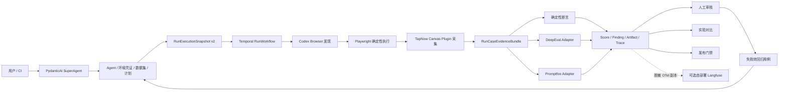

# TapNow 类 Agent 生产测试闭环设计

- 日期：2026-07-11
- 状态：已批准，待用户审阅书面规格
- 任务：TASK-20260711-001
- 适用对象：TapNow 一类通过真实 Web/画布界面接受任务、调用生成能力并改变画布业务状态的目标 Agent

## 1. 目标

在不替换现有平台 Agent 框架和业务模块的前提下，使平台能够真实、可靠、可诊断地测试 TapNow 类目标 Agent，并让执行产生的数据进入平台已有的 Agent、环境与凭证、数据集、测试计划、运行、评分器、安全、人工审核、实验对比、报告和发布门禁模块形成闭环。

完成后的最小生产能力是：平台从不可变测试计划快照启动运行，在隔离浏览器中受控取得短期凭证并登录目标产品，执行真实画布任务，等待目标 Agent 完成，提取画布节点、连线、业务状态和生成产物，运行确定性断言、质量评测与安全评测，保存可审计证据，并将确认的问题转为新的回归用例。

## 2. 设计原则

1. 平台是唯一业务事实来源。Run、RunCase、Trace、Score、Artifact、Finding、Review、Experiment 和 Gate 的最终状态由平台保存。
2. 外部评测工具只实现可替换适配器，不拥有任务编排、资产版本或发布状态。
3. PydanticAI SuperAgent 和 9 个领域 SubAgent 继续负责意图识别、结构化资产和平台能力调用，不直接执行浏览器、DeepEval 或 Promptfoo。
4. Temporal `RunWorkflow` 是唯一生产执行编排入口；所有外部 I/O 位于 Worker Activity 或 Adapter。
5. Worker 不连接业务数据库。小结果经回调写回控制面，大型证据先上传对象存储并返回描述符。
6. 技术执行结果、质量判定和安全判定分离，禁止用单一布尔值掩盖故障语义。
7. 默认只读和最小权限。删除、发布、支付、订阅和权限变更等高风险动作默认禁止。
8. 禁止 Mock、占位或依赖缺失时的假成功。未运行的评测必须显式标记为 error 或 unavailable。

## 3. 范围与非目标

### 3.1 本设计范围

- TapNow 类 Web/画布 Agent 的自动登录、真实任务执行、完成态等待和证据采集。
- Codex Browser 探索结果向确定性 Playwright 回归的固化链路。
- TapNow 领域 Canvas Plugin 的节点、连线、状态和多媒体产物规范化。
- DeepEval 质量评测适配器和现有 Promptfoo 安全适配器的生产闭环。
- 统一执行证据、评分、安全发现和阶段事件契约。
- 人工审核、失败转用例、实验对比和发布门禁联动。
- 真实 E2E、故障注入、批量回归和生产运行手册的验收要求。

### 3.2 非目标

- 不替换 PydanticAI、Temporal、现有 Run 模型或平台测试资产体系。
- 不在首期引入 RAGAS。TapNow 不是以检索增强生成质量为核心的 RAG 场景。
- 不在首期引入 LangSmith。其数据集、实验和观测能力与平台现有模块及 Langfuse 选项重叠。
- 不把 Langfuse 作为执行依赖或事实来源；它只作为后续可选的 OpenTelemetry 观测副本。
- 不允许测试平台自动修改或发布目标 Agent 的生产版本。
- 不在首期支持目标产品的高风险写操作测试；这类测试需后续独立安全设计。

## 4. 现状与关键缺口

### 4.1 已有能力

- 控制面已有 PydanticAI SuperAgent、9 个领域 SubAgent 和平台能力网关。
- Run 使用不可变 Agent、环境、用例和评测策略快照，经 Temporal 调度 API Runner。
- Worker 已有 API、Playwright、Browser Harness 和 Codex Browser 执行路径。
- Agent 版本已有 `target_config`，可保存 TapNow URL、插件、登录策略、凭证引用和浏览器实例引用。
- Canvas Plugin 已定义 `CanvasTrace`、节点、连线、产物和断言协议。
- Scorer 已有 rule、reference、model 等类型；Model Runner 已支持真实文本和视觉 Judge。
- Promptfoo 已有真实安全扫描适配器，缺失运行时时明确失败。
- 平台已有人工审核、实验对比、报告和发布门禁模块。

### 4.2 必须补齐的缺口

1. `codex_explore` 当前保存生成脚本和日志，但没有把候选脚本交给 Playwright 真实执行，因此不能作为回归执行证据。
2. Playwright 当前只支持简单固定步骤，使用临时 headless 浏览器，未完整复用登录策略、浏览器实例和凭证租约。
3. Canvas 采集依赖固定的 `window.__canvasState`，没有通过 TapNow 插件实现可版本化的页面/网络/API 采集策略。
4. 浏览器截图以 Base64 放入内存结果，缺少截图、录像、Trace、网络记录和多媒体产物的对象存储描述符闭环。
5. `RunCaseResult` 只表达 output、trace 和简单 score，不能完整承载执行结果、画布证据、Artifact、评测证据和安全 Finding。
6. 当前多模态评分仍有基于 URL/关键词的启发式实现，不能作为生产图片质量结论。
7. DeepEval 尚未真实集成；模型评分、轨迹评分和多模态评分没有统一适配到现有 Scorer 版本体系。
8. Promptfoo 已有适配器但尚未在完整真实部署拓扑中完成 TapNow 目标、证据回写和门禁验收。
9. 账号密码凭证已经保存为项目凭证引用，但执行端缺少受控短期取密和目标站自动登录闭环。
10. 运行阶段、重试 attempt、部分证据和错误分类缺少完整的可观测事件契约。

## 5. 方案比较与选择

### 5.1 方案 A：外部平台并行运行

DeepEval、Promptfoo、Langfuse 或 LangSmith 各自管理测试数据和结果。优点是接入快；缺点是产生多套 Run、数据集、报告和权限体系，失败无法自然进入平台审核、实验和门禁，违背平台闭环目标。

### 5.2 方案 B：平台原生适配器闭环

现有 Temporal 和 Worker 负责统一执行，外部工具只接收标准输入并返回平台标准 Score、Finding 或 Trace。平台继续管理全部资产版本、状态和审计。该方案需要补充契约和 Worker，但具有最强的一致性、可替换性和生产可控性。

### 5.3 方案 C：运行完成后异步补充评测

浏览器运行先结束，再把证据异步发送给评测系统。优点是不阻塞主执行；缺点是门禁延迟、状态一致性和人工审核等待更复杂。适合低风险观测和非阻断性指标，不适合全部质量与安全判定。

### 5.4 决策

采用方案 B。Langfuse 等非阻断观测可使用方案 C 异步镜像，但不得影响 Run 最终结果或成为唯一证据来源。

## 6. 总体架构

## 7. 模块职责

### 7.1 Test Agent 控制面

- `target_agent`：创建目标 Agent 与不可变版本，维护 `target_config` 和插件版本。
- `environment`：维护项目凭证、浏览器实例和隔离环境模板。
- `test_data`：创建数据集、用例、期望结果和安全边界。
- `test_plan`：绑定 Agent、数据集、执行策略、Scorer 和 Security Profile。
- `execution`：预估成本、请求必要确认、启动/取消 Run 和生成报告。
- `evaluation`：管理 Scorer 版本、阈值、Rubric 和模型配置引用。
- `security`：管理 Promptfoo 安全 Profile、扫描和 Finding。
- `experiment`：比较 Agent 版本、用例级分数和失败类型。
- `review_gate`：处理低置信度/冲突结果和发布门禁。

SuperAgent 和 SubAgent 只能通过公开 Application 接口操作以上模块。它们不持有浏览器、目标站凭证或外部评测 SDK。

### 7.2 Temporal 与 Worker

`RunWorkflow` 继续负责编排、重试、取消和恢复。网络、浏览器、对象存储、模型和评测调用全部位于 Activity/Adapter。建议最终执行顺序：

1. 校验不可变运行快照和项目边界。
2. 创建隔离浏览器并申请短期凭证租约。
3. 按插件登录策略登录 TapNow 并验证成功态。
4. 对探索型用例运行 Codex Browser，产出候选步骤与页面证据。
5. 将批准或固化的候选步骤交给 Playwright 确定性执行；生产回归结果只以真实执行为准。
6. 等待插件定义的稳定完成条件，而不是仅等待固定时间。
7. 通过 TapNow Canvas Plugin 采集画布快照和产物。
8. 上传大型证据到对象存储并形成描述符。
9. 运行确定性断言、DeepEval 和绑定的 Promptfoo 安全测试。
10. 将统一结果回调控制面，必要时等待人工审核，再计算 Run 和 Gate 结论。
11. 无论成功、失败或取消，都关闭隔离资源并销毁临时凭证。

### 7.3 TapNow Canvas Plugin

插件只依赖公开 Plugin SDK，提供以下可版本化能力：

- 登录页面定位、登录成功和失败判据。
- 任务输入控件、发送动作和目标 Agent 完成态判据。
- 高风险动作选择器和网络请求策略。
- 节点、连线、属性、状态和执行日志的规范化采集。
- 图片、视频和其他业务产物的识别与描述符提取。
- 画布确定性断言及插件版本元数据。

插件不得读取平台数据库或平台内部模块，不得把目标站 Cookie、Token 和密码写入 Trace。

## 8. 数据契约

### 8.1 `RunExecutionSnapshot v2`

在现有快照上补齐以下结构，保持不可变和可版本化：

- `AgentSnapshot`：目标 URL、插件 ID/版本、登录策略、凭证绑定 ID、浏览器实例 ID、目标能力和安全边界。
- `CaseExecutionSnapshot`：测试意图、输入、期望输出、画布结构断言、Rubric、执行模式和用例标签。
- `ExecutionPolicySnapshot`：阶段超时、Run 总预算、重试、并发、浏览器模式、Artifact 保留策略和成本上限。
- `EvaluationPolicySnapshot`：Scorer 版本与阈值、模型配置引用、低置信度阈值和是否阻断。
- `SecurityPolicySnapshot`：Promptfoo Profile 版本、扫描范围、阻断严重度和允许动作。

快照只保存引用，不保存账号密码、Cookie、Token 或 API Key。

### 8.2 `RunCaseStageEvent`

记录 `preparing`、`credential_lease`、`authenticating`、`executing`、`waiting`、`collecting`、`evaluating`、`awaiting_review` 和 `cleanup` 等阶段。每个事件包含：

- `project_id`、`run_id`、`run_case_id`、`attempt`。
- `stage`、`status`、开始/结束时间、持续时间。
- 脱敏摘要、错误分类和关联 Artifact/Trace ID。

Run 和 RunCase 的主状态仍使用现有 `queued/running/passed/failed/error/cancelled`，阶段事件用于解释过程，不增加互相冲突的第二主状态机。

### 8.3 `RunCaseEvidenceBundle`

- `ExecutionOutcome`：`success/error/cancelled`、错误类型、尝试次数、目标页面状态和耗时。
- `QualityDecision`：`pass/fail/review_required`、聚合规则和审阅状态。
- `SecurityDecision`：`clear/finding/blocked`、最高严重度和阻断依据。
- `CanvasSnapshot`：规范化节点、连线、属性、状态和结构差异。
- `ArtifactDescriptor`：对象存储 Key、内容类型、哈希、大小、来源阶段、脱敏状态和保留策略。
- `TraceDescriptor`：步骤、工具调用、网络摘要、截图/录像索引和 OpenTelemetry Trace ID。
- `CaseScore`：Scorer/版本、指标、阈值、分数、通过结果、解释、置信度、证据引用、模型配置快照、Token 和成本。
- `SecurityFinding`：Profile/规则版本、漏洞类型、严重度、攻击样本摘要、证据引用和处置状态。

大型截图、录像、网络记录、多媒体和完整 Trace 不作为 Base64 放进 Temporal 结果或业务数据库。

## 9. 凭证与浏览器安全

1. Control API 通过项目权限校验后颁发绑定 Run/RunCase/Worker 的短期一次性凭证租约。
2. Worker 只在 Activity 内存中解密和使用凭证，不落盘、不进入 Workflow 历史、不进入日志。
3. 优先使用隔离的持久浏览器实例或短期 storage state；不得直接复用开发者日常浏览器目录。
4. 登录遇到验证码、MFA 或异常风控时不自动绕过，返回 `EnvironmentError` 并要求人工建立受控登录态。
5. Cookie、Authorization、Token、API Key、账号和密码按字段与模式双重脱敏。
6. Artifact 和对象存储 Key 强制关联 `project_id`，下载需要项目权限和审计。
7. 默认阻止删除、发布、支付、订阅和权限变更；后续高风险模式必须独立环境、显式授权、业务幂等键和审计。

## 10. 评测工具选择

### 10.1 DeepEval

DeepEval 作为 Evaluation Runner 内的质量评测适配器，负责：

- 端到端任务完成度。
- Agent 轨迹与工具调用正确性。
- 文本 Rubric 和 LLM-as-a-Judge。
- 图片/多模态质量与提示一致性。

适配器输入是平台标准 Evidence，输出是平台 `CaseScore`。DeepEval 测试用例、Metric 名称、Prompt、模型配置和版本必须进入 ScorerVersion 快照。生产结论不得使用现有 URL/关键词启发式评分器；启发式实现只能用于本地开发辅助并明确标记非生产。

### 10.2 Promptfoo

Promptfoo 延续现有安全模块，负责 Prompt Injection、Jailbreak、越权、敏感数据泄露、危险工具调用和自定义策略扫描。它输出平台 `SecurityFinding`，由安全模块和发布门禁消费。扫描目标必须是经过 SSRF 校验的真实目标或受控 Worker 适配器，非零退出、超时和无效 JSON 都是扫描错误而不是 Finding。

### 10.3 Langfuse

Langfuse 只作为后续可选、自部署的 OpenTelemetry 观测后端。平台异步发送脱敏 Trace 副本，用于 LLM 调用、Token、延迟和成本分析。Langfuse 不参与 Workflow 判定，故障不阻塞 Run，也不保存唯一业务事实。

### 10.4 RAGAS 与 LangSmith

- RAGAS 仅在未来接入 RAG Agent 时作为领域 Scorer 插件启用，本任务不引入。
- LangSmith 仅在客户明确需要 LangChain/LangGraph 生态互通时作为连接器评估，本任务不引入。

依赖初始兼容目标遵循技术架构文档中的 DeepEval 4.0.5 和 Promptfoo 0.121.17。实施计划第一步必须用官方文档核对当前稳定版、许可证、Schema 和 Python/Node 兼容性；若需要偏离架构版本，先提交 ADR，再固定精确版本和 Lockfile。

## 11. 状态、错误与重试

### 11.1 结果语义

- `ExecutionOutcome` 表达平台是否成功执行目标任务。
- `QualityDecision` 表达输出是否满足质量要求。
- `SecurityDecision` 表达是否发现安全问题或需要阻断。
- RunCase 主状态由三者聚合：执行 error 优先为 `error`；取消为 `cancelled`；有效执行但质量或安全不通过为 `failed`；全部满足且无需审核为 `passed`。
- `review_required` 不新增主终态。RunCase 保持 `running`，阶段进入 `awaiting_review`；审核完成后再聚合到 passed 或 failed。

### 11.2 错误分类

沿用并细化现有错误类型：

- `ValidationError`：快照、插件或输入不合法。
- `PermissionError`：项目权限、凭证或 Artifact 访问越界。
- `EnvironmentError`：凭证错误、验证码、MFA、浏览器环境或依赖不可用。
- `TargetProductError`：TapNow 页面/接口明确失败或业务额度不足。
- `TransientError`：网络抖动、429、临时 5xx 或对象存储短暂超时。
- `PlatformError`：Worker、Temporal、协议、回调或平台内部错误。
- `CancelledError`：用户或门禁策略取消。

错误消息和 Trace 必须脱敏，保留可操作诊断信息和关联证据。

### 11.3 重试策略

- Worker 暂时不可用和对象存储瞬态超时：最多 3 次，指数退避，必须带幂等键。
- 目标页面加载超时、HTTP 429/瞬态 5xx：最多 2 次，受阶段和 Run 总预算约束，每次 attempt 独立留证。
- 账号密码错误、验证码/MFA：不自动重试。
- 非幂等或潜在副作用步骤：不自动重试。
- 断言失败、DeepEval 低分和安全 Finding：不重试，它们是有效测试结果。

### 11.4 取消与清理

Temporal Signal 传播到正在运行的 Activity。取消后不再启动新步骤或评测；Worker 上传最后截图、错误页和已完成步骤摘要，随后关闭浏览器、销毁临时凭证并清理临时文件。清理失败单独记录审计事件，不覆盖原始取消原因。

## 12. 失败闭环

1. 确定性断言失败直接生成结构化差异。
2. 模型评分低置信度、Scorer 冲突或高风险输出进入人工审核。
3. 高危安全 Finding 直接阻断发布门禁，同时进入安全处置队列。
4. 审核确认的问题可一键生成 TestCase 草稿，自动引用输入、期望、失败证据和插件版本。
5. 用户确认后发布新的 DatasetVersion，原版本保持不可变。
6. 新旧 AgentVersion 在相同 DatasetVersion 上运行实验对比。
7. Release Gate 根据通过率、关键用例、安全 Finding、成本和人工审核状态决定是否允许发布。

## 13. 可观测性与运营

- 所有阶段携带统一 `project_id/run_id/run_case_id/attempt/trace_id`。
- 指标覆盖调度延迟、阶段耗时、成功率、错误分类、重试、Token、模型成本、浏览器资源和 Artifact 上传。
- 对 Worker 离线、队列积压、回调失败、对象存储失败、凭证租约异常和高危 Finding 建立告警。
- Artifact 设置项目级保留期、合法保留和删除审计。
- 提供凭证轮换、Worker 扩缩容、Run 恢复、Temporal 故障、对象存储恢复和目标站风控的 Runbook。

## 14. 分阶段实施

### 14.1 阶段 1：真实执行闭环（P0）

- 短期凭证租约和隔离浏览器自动登录。
- Codex Browser 发现到 Playwright 确定性执行的固化链路。
- TapNow Canvas Plugin 的真实节点、连线、状态和产物采集。
- 截图、录像、网络摘要、Trace 和产物上传对象存储。
- 标准 Evidence 回调现有 Run、RunCase 和报告。

阶段 1 完成前，平台不得宣称已经具备 TapNow 生产回归能力。

### 14.2 阶段 2：质量与安全闭环（P0）

- DeepEval 适配统一 Scorer 契约。
- Promptfoo 绑定真实目标、Finding 回写和门禁。
- 确定性断言、模型评分、低置信度审核和失败转用例。

### 14.3 阶段 3：规模与发布闭环（P1）

- 50–500 条批量回归、并发和成本控制。
- Agent 版本实验、评分漂移监测和 CI 发布门禁。
- 可选 Langfuse 自部署观测镜像。
- 容量、备份恢复、告警和运行手册验收。

每个阶段独立登记任务、实施计划和验收，禁止一次跨越所有模块并行开发。

## 15. 测试与验收

### 15.1 自动化测试矩阵

- 契约测试：Snapshot、StageEvent、Evidence、Score、Finding 和 Artifact Schema 的兼容性与版本化。
- 单元测试：插件登录/完成态/采集、错误分类、重试判定、聚合规则、脱敏和门禁。
- Workflow 测试：Temporal Replay、超时、重试、取消、幂等、人工审核等待和 Worker 重启恢复。
- 集成测试：Fake TapNow 覆盖成功、登录失败、风控、额度不足、超时、节点错误、低质量产物和安全攻击。
- 基础设施测试：PostgreSQL 项目隔离、MinIO Artifact、Promptfoo、DeepEval、Model Runner 和回调。
- 真实 E2E：专用 TapNow 测试环境和账号完成登录、任务执行、画布采集、评分、报告、审核、回归和门禁。
- 负载测试：50–500 条用例下的调度成功率、队列延迟、Worker 并发、模型预算和对象存储吞吐。

### 15.2 最低真实验收场景

1. 从平台创建目标 Agent、凭证、数据集、用例和测试计划。
2. 在全新隔离浏览器中自动登录 TapNow，凭证不出现在日志、Trace 或 Workflow 历史。
3. 发送一条真实画布任务并等待稳定完成态。
4. 提取真实节点、连线、图片/视频产物和执行证据。
5. 执行确定性断言、DeepEval 质量评分和绑定的 Promptfoo 安全扫描。
6. 在运行工作台查看 Trace、截图/录像、Score、Finding、错误分类和成本。
7. 将一个确认失败转换为回归用例并发布数据集新版本。
8. 对两个 Agent 版本运行实验，并由发布门禁给出可解释结论。

### 15.3 反向验收

必须故意验证：凭证错误、验证码/MFA、页面超时、目标 429/5xx、目标额度不足、Worker 重启、对象存储失败、回调失败、节点结构错误、低质量图片、Prompt Injection、越权请求、用户取消和依赖缺失。每种场景都必须返回正确状态、错误类型、重试行为和脱敏证据。

### 15.4 生产完成定义

- 真实执行、评测和证据链全部运行，无 Mock、占位或假成功。
- Run 可通过不可变快照、插件/Scorer/模型版本和 Artifact 完整复现与诊断。
- 数据强制 `project_id` 隔离，凭证与日志脱敏通过安全测试。
- 关键 Workflow Replay、取消、重试、幂等和恢复测试通过。
- 真实 TapNow E2E 与反向验收通过。
- 生产监控、告警、容量、备份恢复和 Runbook 已验证。
- 所有未执行验证明确记录风险，不以推测代替证据。

## 16. 官方工具依据

- DeepEval 支持端到端、组件级、轨迹、工具调用和多模态评测：<https://deepeval.com/docs/introduction>
- Promptfoo 支持通过 HTTP、浏览器和自定义目标执行红队及 CI/CD：<https://www.promptfoo.dev/docs/red-team/quickstart/>
- Langfuse 支持基于 OpenTelemetry 的 LLM Trace、评分与自部署：<https://langfuse.com/docs/observability/overview>
- RAGAS 主要提供 RAG 与部分 Agent/工具指标，本任务不采用：<https://docs.ragas.io/en/v0.2.2/concepts/metrics/available_metrics/>
- LangSmith 提供线上/离线评测、数据集和实验，本任务不采用：<https://docs.langchain.com/langsmith/evaluation>

## 17. 已确认决策

- 首个生产目标：TapNow 类 Web/画布 Agent。
- 集成策略：方案 B，平台原生适配器闭环。
- 数据归属：平台各业务模块形成闭环，平台是唯一事实来源。
- Agent 框架：保留现有 PydanticAI SuperAgent 与 9 个 SubAgent。
- 执行框架：保留 Temporal、API Runner、Model Runner、Playwright/Codex Browser 和 Canvas Plugin。
- 工具组合：DeepEval + 现有 Promptfoo；Langfuse 仅作为后续可选观测；不接入 RAGAS 和 LangSmith。
- 部署基线：核心执行、凭证、证据和业务结果在自有环境处理。
- 安全基线：项目隔离、短期取密、默认只读、高风险动作阻断和全链路审计。
