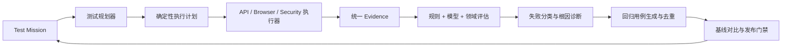

# Agent 测试可信闭环优化设计

## 1. 背景与目标

现有平台已经具备 Test Mission、资产编排、API/浏览器执行、统一证据、评分、安全检查、人工审核与发布门禁，但生产可信度仍有两个核心缺口：测试路径尚未全部经过真实 Control API → Temporal → Worker → Target 公共链路，评估、诊断、失败回归与门禁之间也缺少稳定的工程反馈系统。

本阶段从高级 Agent 测试工程视角，把平台优化为“执行可信、评估可信、诊断可证、回归可复现、门禁可解释”的完整闭环。Agent 负责探索、生成和解释；确定性系统负责权限、事实采集、执行、状态、评分聚合和发布决策。

## 2. 核心原则

1. 流程完成不等于测试成功，技术执行、断言、质量和安全保持独立结论。
2. 每个结论必须引用不可变 Evidence；证据不足时不得输出确定结论。
3. 模型不能修改原始事实、扩大动作 Allowlist、绕过权限或直接决定发布。
4. 所有执行必须经过生产同构公共路径，禁止以 Mock 或前端展示代替全栈成功。
5. 自动生成的回归用例必须先复现原始失败，才能发布为长期资产。
6. 相同不可变快照应可复现；重试、恢复、取消和重复确认必须幂等。
7. 高危安全问题、关键路径失败和证据缺失不能被平均质量分抵消。

## 3. 总体架构

采用纵向闭环分阶段增强，而不是按技术模块分别重写。

所有阶段共享不可变 Mission Revision、执行快照、统一证据协议和可回放事件流。既有 Agent、数据集、用例、评分器、Run、Artifact、Review、Report 和 Release Gate 模块继续作为事实来源。

## 4. 真实执行基座

### 4.1 生产同构 Fake Target

Fake Target 是正式测试基础设施，不是单元测试桩。测试必须通过公开 Control API 创建 Mission，经 Temporal 调度真实 Worker，再访问独立 Target 进程并由公开 API 核验平台记录。

Fake Target 提供 API 与浏览器两种入口，并支持确定性故障模式：

- 正常成功、流式响应和多轮状态保持。
- 产品错误、协议错误和不完整业务产物。
- 登录过期、重新登录和原任务恢复。
- 超时、限流、额度不足和瞬时网络失败。
- 工具调用异常、重复回调和回调乱序。
- Prompt Injection、数据泄漏和越权诱导。
- Worker 重启、重复确认、取消竞态和恢复重放。

每种故障模式拥有固定输入、可观察副作用和预期错误分类，保证测试能证明平台发现了错误，而不只是证明成功路径可运行。

### 4.2 执行可靠性

- 使用 `mission_revision_id + stage` 和业务对象幂等键去重。
- 非幂等目标动作默认不自动重试；只读查询和平台内部回调允许有限重试。
- Worker 重启后由 Temporal History 和阶段回执恢复，不重新调用模型规划。
- 登录态失效进入 `needs_attention`，验证原 Browser Profile 后从中断阶段恢复。
- 取消后停止派发新阶段，保留已生成资产与 Evidence。
- 重复确认返回原 Mission/Workflow，不创建重复 Run 或版本资产。

## 5. 统一结果与 Evidence

每个 RunCase 独立保存：

- `execution_outcome`：目标是否真实执行成功。
- `assertion_outcome`：确定性断言是否满足。
- `quality_outcome`：语义和领域质量是否达到阈值。
- `security_outcome`：是否出现安全 Finding 或越权行为。

统一 Evidence 至少覆盖请求与响应摘要、浏览器步骤、截图、网络与控制台异常、Agent 工具调用、业务产物、时延、Token 和成本。Evidence 使用内容哈希、采集时间、生产者、Run/Case/Stage 作用域和脱敏状态；大对象进入 Artifact Store，数据库只保存引用和完整性元数据。

密码、Token、Cookie 和明文 Auth State 在进入日志、Trace、Temporal History、Artifact 元数据或模型评审前统一脱敏。无法完成脱敏或完整性校验的证据不得进入模型评审。

## 6. 分层评估与校准

评估按以下顺序进行：

1. 硬规则：状态码、Schema、字段、节点、文件和业务状态等确定性断言。
2. 领域评分：画布结构、工具调用正确性、多轮状态一致性等专用 Scorer。
3. 模型评审：仅判断语义质量、任务完成度和用户体验，不覆盖硬规则。
4. 结果仲裁：低置信度、评审器冲突、相对基线显著退化或高风险结果进入 Review。
5. 持续校准：使用人工标注集计算准确率、误报率、漏报率和一致性。

未达到校准阈值的模型评分不能单独阻断发布。评分结果必须记录 Scorer 版本、Prompt/规则版本、输入 Evidence 引用、置信度和解释摘要。

## 7. 证据约束的失败诊断

确定性分类器先把失败归入：

- `target_failure`：被测 Agent 或目标产品失败。
- `test_failure`：测试步骤、选择器、断言或测试数据错误。
- `environment_failure`：登录态、网络、额度、依赖服务或浏览器环境异常。
- `platform_failure`：Control API、Temporal、Worker、Artifact 或回调链路异常。
- `evaluation_failure`：评分器不可用、评审冲突或评分证据不足。

诊断 Agent 只能基于已持久化 Evidence 生成根因假设。每条假设必须包含证据引用、置信度、可能反证和建议验证步骤；没有足够证据时输出“无法确定”。诊断输出是附加分析，不修改 Run、RunCase 或原始 Evidence。

## 8. 自动回归闭环

失败回归流程：

1. 固化失败输入、目标版本、执行快照和关键 Evidence。
2. 在相同安全边界内删除无关步骤或输入，生成候选最小复现。
3. 用错误指纹、调用链和语义特征进行聚类去重。
4. 重跑候选最小复现；只有稳定复现原错误才创建候选回归用例版本。
5. 修复后执行原用例、最小复现和同类回归集。
6. 连续达到稳定性阈值后发布为长期回归；不稳定用例进入 Quarantine，并保留原因和证据。

静默重试得到的绿色结果不能覆盖首次失败，也不能自动解除 Quarantine。

## 9. 基线与发布门禁

门禁同时检查：

- 关键任务成功率和关键路径失败。
- 相对已批准基线的质量、延迟、Token 与成本退化。
- 严重/高危安全 Finding。
- 新增失败类型和失败聚类规模。
- 不稳定率、Quarantine 数量和证据完整率。
- 模型评分置信度、校准状态和 Review 结论。

门禁输出 `allow`、`block` 或 `needs_review`，并列出每个阻断规则、阈值、实际值和 Evidence/Review 引用。聚合平均分不能抵消关键路径失败、高危安全问题或证据缺失。

## 10. 前端产品闭环

测试 Agent 对话和结构化控制台共同展示：

- 不可变测试计划、系统推断和动作边界。
- API、浏览器、安全、评分、诊断、回归和门禁实时阶段。
- 四类 Outcome、失败责任域、根因假设和 Evidence 引用。
- 自动生成的最小复现、回归资产、Quarantine 状态和基线差异。
- 门禁结论、阻断原因和需要 Review 的冲突。

刷新、会话切换、SSE 断线、Control API 或 Worker 重启后均从数据库、事件游标和 Temporal 状态恢复，不能依赖前端内存。

## 11. 错误处理与安全

- 外部错误、平台错误、评估错误和质量失败使用不同状态与告警，不互相覆盖。
- 目标页面、Agent 回复、工具输出和上传文件全部视为不可信输入。
- Prompt Injection 内容不能改变系统指令、项目作用域、预算、确认或动作 Allowlist。
- 所有 URL、重定向和下载执行 SSRF 与内容类型校验。
- 诊断与评估模型使用最小化、脱敏后的 Evidence 视图。
- 高风险操作仍需独立确认；本阶段不自动修改或发布目标 Agent。

## 12. 分阶段实施

### 阶段 1：真实执行基座

完成生产同构 Fake Target、公开路径全栈测试、故障注入、重试/恢复、取消和幂等。

### 阶段 2：统一评估协议

固化四类 Outcome、Evidence 完整性、评分置信度、评审冲突和错误分类。

### 阶段 3：智能诊断与回归

实现证据约束诊断、错误指纹、失败聚类、最小复现和复现后发布回归用例。

### 阶段 4：基线与门禁

实现版本基线、退化检测、不稳定率、成本预算、证据完整率与安全风险联合门禁。

### 阶段 5：产品闭环

完成对话、进度、诊断、回归、基线和门禁的前端展示与断线恢复。

## 13. 测试与验收

- Fake Target 注入的每类故障均被平台发现并正确分类，不出现假成功。
- 相同不可变快照重复执行可复现，重复确认不创建重复资产。
- 登录过期、Worker 重启、回调重试和取消竞态不丢失阶段状态。
- 每个结论能追溯到 Evidence；证据不足时不会生成确定结论。
- 自动生成的回归用例先稳定复现原失败，再进入候选版本。
- 高危安全问题、关键路径失败和证据缺失阻断发布门禁。
- 至少一个获准的真实目标 Agent 完成只读成功验收。
- 后端、数据库、Worker、插件、前端、公开 API E2E、架构测试、API 漂移和生产构建全部通过。

真实目标账号、登录态或额度不可用时，必须把外部验收标记为阻塞，不能宣称生产门禁已通过。

## 14. 非目标

- 不引入第二套工作流引擎或重复的资产事实库。
- 不让模型直接写入原始 Evidence、Run 结论或发布状态。
- 不自动修复、修改或发布被测 Agent。
- 不以无限重试掩盖不稳定用例。
- 不在本阶段替换既有 Agent、数据集、Run、Artifact、Review、Report 和 Gate 模块。
