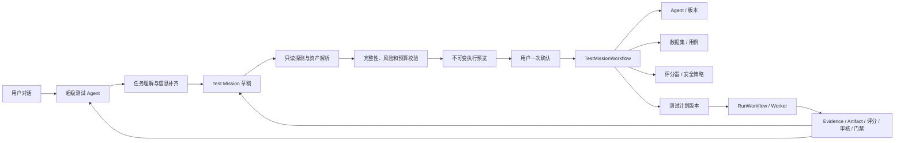

# 对话式 Agent 全链路测试任务设计

## 1. 背景与目标

平台已经具备超级测试 Agent、多领域 SubAgent、Agent/版本、数据集、测试计划、Run、浏览器 Profile、Temporal Worker、评分、安全、审核、实验和发布门禁等能力，但当前对话主要以零散 Capability 调用为单位，缺少一个可恢复、可确认、可审计的“测试任务”事实模型。

本阶段新增对话式测试任务闭环。用户可以只提供目标 Agent URL 和一句业务目标；系统自动匹配平台资产、执行只读探测、识别缺失信息、生成候选用例与评分规则，并在一次完整确认后自动创建或复用平台资产、启动真实全链路测试，最终将过程和结果落入现有平台模块。

关键产品决策：

- 用户只做一次普通执行确认；删除、付费、发布、权限变更等高风险动作仍需独立确认。
- 平台中没有目标 Agent 时，允许从 URL 进行只读探测并生成接入草稿。
- 没有现成用例或验收标准时，自动生成候选内容，明确标记系统推断及置信度，并在确认时供用户审阅。
- 自动识别执行通道：API 可用时承担主回归，浏览器覆盖关键用户链路，同时执行安全基线、评分和证据采集。

## 2. 设计原则

1. **模型理解，规则决策**：模型负责意图和信息提取；确定性规则负责完整性、权限、预算、风险和是否可执行。
2. **平台资产是事实来源**：对话不维护 Agent、用例、计划、Run 或评分结果的副本，只关联现有模块对象。
3. **确认内容不可变**：一次确认产生不可变 Mission Revision；执行期间不重新调用模型改变范围。
4. **默认最小提问**：先读取对话、项目资产和探测结果，只询问无法自动获得的必要信息。
5. **真实执行与证据闭环**：不允许 Mock 成功或只生成脚本不执行；结果必须回写 Run、Evidence、Artifact、评分、安全、审核和门禁。
6. **租户与秘密隔离**：所有业务数据关联 `project_id`；登录态和凭证只以引用及短期租约进入执行面。

## 3. 总体架构

新增 `test_missions` 业务模块，作为现有超级测试 Agent 与平台资产模块之间的编排层。

### 3.1 模块职责

- **超级测试 Agent**：理解自然语言、解释缺失项、调用 Mission 能力、展示实时进度；不得直接凭模型判断启动 Run。
- **Test Mission**：保存用户目标、解析事实、缺失项、系统推断、风险、预算、不可变 Revision、阶段状态和平台资产引用。
- **信息解析器**：将每轮对话合并为结构化事实，保留来源和置信度。
- **平台资产解析器**：项目内匹配 Agent 版本、数据集、失败用例、评分器、环境、Browser Profile 和门禁。
- **只读探测器**：复用浏览器 Profile、Browser Harness 和插件识别登录状态、交互入口、API 能力及可测试任务。
- **确定性校验器**：验证目标可达、登录态、项目归属、版本状态、用例可执行性、预算和动作边界。
- **任务编译器**：把确认预览编译为不可变 Mission Revision，并生成资产创建或复用清单。
- **TestMissionWorkflow**：可靠编排资产准备、Run 启动、结果汇总和失败回流；具体业务写入通过控制面公开应用能力或内部受控 API 完成，Worker 不连接业务数据库。
- **RunWorkflow**：继续负责用例执行、证据采集、评分、安全扫描、审核等待和门禁计算。

### 3.2 状态机

主路径：

`collecting → discovering → ready_for_confirmation → confirmed → provisioning → running → completed`

异常或等待状态：

- `needs_input`：缺少无法自动获得的信息。
- `needs_attention`：登录态失效、预算需要调整或外部依赖恢复后可继续。
- `failed`：不可恢复的平台或编排错误。
- `cancelled`：用户取消，已生成资产和证据保留。

状态转换由应用层显式执行，禁止通过多个布尔字段推断。

## 4. 对话信息补齐流程

### 4.1 必要事实

系统必须获得：

- 测试目标：平台已有 Agent/版本，或目标 URL/API 地址。
- 可访问性：无需登录、有效 Browser Profile，或项目加密凭证引用。
- 测试意图：需要验证的核心业务任务。
- 安全边界：默认只读；写入动作必须明确允许。

每项事实记录以下元数据：

- `source`：`user_provided`、`platform_resolved`、`target_discovered` 或 `system_inferred`。
- `confidence`：0–1。
- `verified`：是否经过确定性验证。
- `sensitive`：是否只能保存引用或加密值。
- `revision`：最后一次修改版本。

### 4.2 自动补齐

- 匹配同项目 Agent、版本、数据集、历史失败、评分器、环境和门禁。
- 只读探测交互入口、API/浏览器通道、登录状态和业务能力。
- 生成正常、异常、边界、安全和多轮任务候选用例。
- 选择确定性断言、LLM Judge、DeepEval、Promptfoo及领域插件评分。
- 估算用例数、执行时间、模型调用量、浏览器资源和成本区间。

### 4.3 最小提问与确认

系统每轮只询问当前无法自动获得且会阻塞执行的信息。信息完整后展示一张确认卡，包含目标版本、登录状态、执行通道、用例覆盖和来源、推断验收标准、评分器、预算、预计耗时、动作边界和资产清单。

用户确认后生成带内容哈希的不可变 Revision。确认后修改需求会创建新 Revision；正在运行的快照不被篡改。

## 5. 数据模型

### 5.1 `test_missions`

- `mission_id`、`project_id`、`session_id`、`created_by`
- `status`、`active_revision_id`、`lock_version`
- `created_at`、`updated_at`、`completed_at`

约束：项目外键、会话关联、项目/状态索引、乐观锁。

### 5.2 `test_mission_facts`

- `fact_id`、`project_id`、`mission_id`、`field_key`
- `value_json` 或秘密引用
- `source`、`confidence`、`verified`、`sensitive`
- `fact_revision`、时间戳

约束：`project_id + mission_id + field_key` 唯一；不得保存 Cookie、密码、Token 或明文 Storage State。

### 5.3 `test_mission_revisions`

- `revision_id`、`project_id`、`mission_id`、`revision_number`
- `snapshot_json`、`content_hash`
- `risk_summary_json`、`budget_json`、`estimate_json`
- `confirmed_by`、`confirmed_at`、`created_at`

Revision 只追加不可更新，`mission_id + revision_number` 和内容哈希建立唯一约束。

### 5.4 `test_mission_assets`

- 关联 Agent 版本、数据集版本、测试用例、评分器、计划版本、Run、实验、审核、报告和门禁。
- 保存 `asset_type`、`asset_id`、`relation`、`stage` 和时间戳。
- `relation` 包括 `reused`、`created`、`result`、`generated_from_failure`。

### 5.5 `test_mission_events`

追加式保存补齐、探测、预检、确认、资产创建、运行阶段和结果事件。事件通过 Outbox 可靠发布到现有对话 SSE；刷新和断线后按游标恢复。

## 6. 平台数据闭环

| 过程数据 | 平台落点 | 用途 |
|---|---|---|
| 用户目标与目标探测 | Mission Facts、Agent 接入草稿 | 接入复用与重新探测 |
| 候选任务 | 测试用例、数据集版本 | 回归与人工编辑 |
| 断言和评分标准 | Scorer、测试计划版本 | 自动评估与版本对比 |
| 浏览器执行 | Run Case、Stage Event、Trace、截图、录像、网络、控制台日志 | 定位真实问题 |
| Agent 输出和业务状态 | Evidence、Artifact、插件领域产物 | 规则、模型与人工评审 |
| 安全测试 | Security Finding、Promptfoo 报告 | 安全趋势与门禁阻断 |
| 低置信度或冲突评分 | Review Task | 人工复核与标注回流 |
| 失败案例 | 候选回归用例/数据集版本 | 修复后持续回归 |
| 多版本结果 | Experiment | 基线/候选差异 |
| 汇总结果 | Report、Release Gate | 审计、下载与发布决策 |

技术执行、产品质量、安全状态和发布结论保持独立语义。执行成功不等于质量通过或允许发布。

## 7. 自动执行与恢复

一次确认后启动 `TestMissionWorkflow`：

1. 验证不可变 Revision 和确认哈希。
2. 创建或复用 Agent、版本、数据集、用例、评分器和计划版本。
3. 发布满足条件的不可变版本。
4. 创建 Run，分流 API 主回归、浏览器关键链路和安全基线。
5. 收集并持久化执行证据。
6. 执行规则、模型、安全和领域插件评分。
7. 创建需要的人工审核任务。
8. 汇总报告、实验和发布门禁。
9. 把失败转为候选回归用例并关联回 Mission 与对话。

可靠性规则：

- 每阶段使用 `mission_revision_id + stage` 幂等键。
- Workflow 重放只读取不可变快照，不重新调用模型决策。
- 每个已成功步骤保存回执；恢复时只补齐缺失步骤。
- 外部调用设置超时、有限重试和退避；非幂等目标动作默认不重试。
- 取消后停止派发新任务并保留已有资产和证据。
- 登录态失效进入 `needs_attention`，用户验证同一 Browser Profile 后从中断阶段恢复。
- 额度不足、目标产品错误、平台错误和质量失败分别分类。
- 达到预算软阈值时停止扩展用例，达到硬阈值时停止新增外部调用。

## 8. 安全设计

- 目标页面、Agent 回复、网页文本和上传文件全部视为不可信输入，不能改变权限或动作边界。
- Revision 编译确定性动作 Allowlist；模型只能在 Allowlist 内选择。
- 删除、支付、发布、权限修改和对外发送始终需要独立高风险确认。
- Browser Profile 使用加密 Auth State 和限定 Run/Case/Profile/版本的短期租约。
- URL 校验协议、域名、重定向和内网地址，阻断 SSRF。
- Trace、网络、截图元数据和错误统一脱敏；秘密不进入对话、普通 API 响应、日志或 Temporal 历史。
- 创建、确认、恢复、取消和高风险决策全部写入审计日志。
- 所有仓储和资产解析强制项目隔离，跨项目引用拒绝。

## 9. 前端交互

复用现有测试 Agent 页面，新增：

- 信息补齐卡：仅展示当前缺失字段，可选择平台已有资产。
- 探测结果卡：展示发现的能力、入口、登录状态、风险和来源。
- 执行确认卡：展示 Revision、推断项、覆盖、预算、风险和资产清单。
- 运行进度与结果卡：展示准备、API、浏览器、安全、评分、审核和门禁阶段。
- 右侧 Mission 上下文：完整度、当前状态、关联资产和 Run。

页面刷新、会话切换或服务重启后，从数据库和事件游标恢复，不能依赖前端内存。

## 10. API 与能力边界

超级 Agent 新增少量 Mission 级 Capability：

- `test_missions.create_or_update`
- `test_missions.discover`
- `test_missions.preview`
- `test_missions.confirm_and_start`
- `test_missions.resume`
- `test_missions.cancel`
- `test_missions.get_status`

细粒度资产 Capability 保留供专业操作使用，但完整测试任务通过 Mission 能力编排。写操作继续走现有确认和权限框架；普通 Mission 只在 `confirm_and_start` 时进行一次确认。

## 11. 测试策略

- 对话理解：多轮补齐、修改、混合语言、无关内容和 Prompt Injection。
- 规则：必要事实、推断来源、确认哈希、预算、风险与跨项目拒绝。
- 数据库：空库、上一版升级、约束、索引、项目隔离和乐观锁。
- Workflow：重放、重试、超时、取消、暂停恢复、幂等、预算熔断和并发。
- 执行：API、多轮会话、浏览器登录态、关键链路、安全、评分和 Artifact。
- 闭环：失败转用例、实验、报告、审核和门禁关联。
- 前端：组件、SSE 重连、刷新恢复、可访问性、Lint、类型、测试、构建和关键 Playwright E2E。
- 安全：SSRF、秘密脱敏、租约范围、外部注入和危险动作拦截。

## 12. 上线验收

1. 只提供目标 URL 和一句测试目标，可完成只读探测并只追问无法获得的信息。
2. 登录态缺失时可引导完成 Browser Profile 登录并恢复任务。
3. 一次确认后自动创建或复用必要资产并启动真实 Run。
4. Fake Target 覆盖成功、产品失败、认证过期、取消、重试和恢复。
5. 至少一个真实目标 Agent 完成只读全链路运行，证据、评分、失败案例、报告和门禁全部落入平台。
6. 前端、后端、数据库、Worker、插件、API 契约、架构和生产构建全部通过。
7. 未获得真实目标账号或额度时标记外部验收阻塞，不宣称已有真实上线证据。

## 13. 非目标

- 不自动修改或发布目标 Agent。
- 不构建新的通用 Prompt 管理平台。
- 不用对话记录替代平台结构化资产。
- 不让模型绕过权限、预算、确认或安全边界。
- 不在本阶段引入第二套工作流引擎或外部观测平台。

